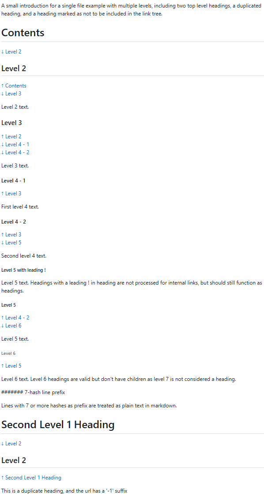
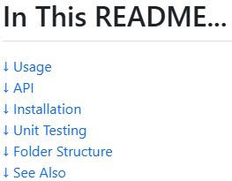
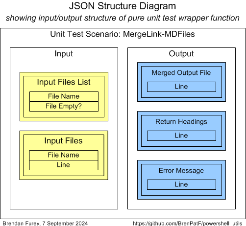
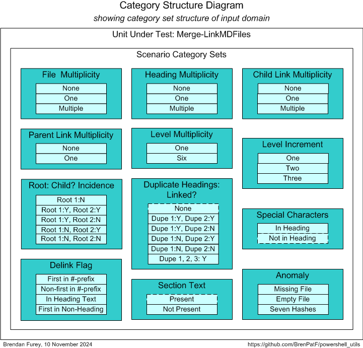
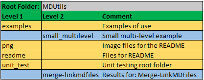

# powershell_utils/MDUtils


> Powershell Markdown Utility module

This module contains a utility that creates a combined markdown (MD) file from a set of constituent MD files listed in an input file. In markdown format section headings are specified by lines beginning with between 1 and 6 '#' characters followed by a space, with section level corresponding to the number of '#'s in the heading, and smaller number meaning higher level.

After merging the constituent files in order, the utility adds, after each heading, a link to any parent heading and a list of links to any child headings. These internal links form a tree structure that enables easy navigation for longer documents.

The heading hierarchy is defined by the simple rule that a heading is the child of the first higher level heading encountered when reading back up the file.

Usage is demonstrated by a simple example and in its use for the current README.

The module is tested using [The Math Function Unit Testing Design Pattern](https://brenpatf.github.io/2023/06/05/the-math-function-unit-testing-design-pattern.html), with test results in HTML and text format included.

# In This README...
[&darr; Usage](#usage)<br />
[&darr; API](#api)<br />
[&darr; Installation](#installation)<br />
[&darr; Unit Testing](#unit-testing)<br />
[&darr; Folder Structure](#folder-structure)<br />
[&darr; See Also](#see-also)<br />
## Usage
[&uarr; In This README...](#in-this-readme)<br />
[&darr; Small Multilevel Example](#small-multilevel-example)<br />
[&darr; This README\.md](#this-readmemd)<br />

To use this utility, start by creating one or more markdown files along with a file that lists them. Then, run the PowerShell utility, providing the input file name and the target merged file name.

In this section we'll show how it works by means of two examples, the first a simple demonstration example, and the second using the current README\.md file.

### Small Multilevel Example
[&uarr; Usage](#usage)<br />
[&darr; Component File List](#component-file-list)<br />
[&darr; Input Markdown File](#input-markdown-file)<br />
[&darr; Target Markdown File](#target-markdown-file)<br />
[&darr; Screenshot of File in Chrome](#screenshot-of-file-in-chrome)<br />
[&darr; Output Heading Tree](#output-heading-tree)<br />

Here is the Powershell script for the simple example, with input file, small_multilevel.lis, and target file SMALL_MULTILEVEL.md. The function Merge-LinkMDFiles writes to standard output a listing of the headings processed, which shows the heading tree structure.

```powershell
Import-Module MDUtils
Merge-LinkMDFiles small_multilevel.lis ..\SMALL_MULTILEVEL.md
```
#### Component File List
[&uarr; Small Multilevel Example](#small-multilevel-example)<br />

This example has a single `input.md` file in the component file list, in small_multilevel.lis:

```
input.md
```

#### Input Markdown File
[&uarr; Small Multilevel Example](#small-multilevel-example)<br />

The input markdown file input\.md is listed below:

	A small introduction for a single file example with multiple levels, including two top level headings, a duplicated heading, and a heading marked as not to be included in the link tree.

	# Contents

	## Level 2

	Level 2 text.

	### Level 3

	Level 3 text.

	#### Level 4 - 1

	First level 4 text.

	#### Level 4 - 2

	Second level 4 text.

	!##### Level 5 with leading !

	Level 5 text. Headings with a leading ! in heading are not processed for internal links, but should still function as headings.

	##### Level 5

	Level 5 text.

	###### Level 6

	Level 6 text. Level 6 headings are valid but don't have children as level 7 is not considered a heading.

	####### 7-hash line prefix

	Lines with 7 or more hashes as prefix are treated as plain text in markdown.

	# Second Level 1 Heading

	## Level 2

	This is a duplicate heading, and the url has a '-1' suffix


#### Target Markdown File
[&uarr; Small Multilevel Example](#small-multilevel-example)<br />

The target markdown file SMALL_MULTILEVEL.md is listed below, showing the links added:

	A small introduction for a single file example with multiple levels, including two top level headings, a duplicated heading, and a heading marked as not to be included in the link tree.

	# Contents
	[&darr; Level 2](#level-2)<br />

	## Level 2
	[&uarr; Contents](#contents)<br />
	[&darr; Level 3](#level-3)<br />

	Level 2 text.

	### Level 3
	[&uarr; Level 2](#level-2)<br />
	[&darr; Level 4 - 1](#level-4---1)<br />
	[&darr; Level 4 - 2](#level-4---2)<br />

	Level 3 text.

	#### Level 4 - 1
	[&uarr; Level 3](#level-3)<br />

	First level 4 text.

	#### Level 4 - 2
	[&uarr; Level 3](#level-3)<br />
	[&darr; Level 5](#level-5)<br />

	Second level 4 text.

	##### Level 5 with leading !

	Level 5 text. Headings with a leading ! in heading are not processed for internal links, but should still function as headings.

	##### Level 5
	[&uarr; Level 4 - 2](#level-4---2)<br />
	[&darr; Level 6](#level-6)<br />

	Level 5 text.

	###### Level 6
	[&uarr; Level 5](#level-5)<br />

	Level 6 text. Level 6 headings are valid but don't have children as level 7 is not considered a heading.

	####### 7-hash line prefix

	Lines with 7 or more hashes as prefix are treated as plain text in markdown.

	# Second Level 1 Heading
	[&darr; Level 2](#level-2-1)<br />

	## Level 2
	[&uarr; Second Level 1 Heading](#second-level-1-heading)<br />

	This is a duplicate heading, and the url has a '-1' suffix

#### Screenshot of File in Chrome
[&uarr; Small Multilevel Example](#small-multilevel-example)<br />

Below is a screenshot of the file SMALL_MULTILEVEL.md when viewed in a Chrome browser, with the Chrome markdown extension active:

&nbsp;&nbsp;&nbsp;&nbsp;&nbsp;&nbsp;

#### Output Heading Tree
[&uarr; Small Multilevel Example](#small-multilevel-example)<br />

The output heading tree produced is:

	# Contents
	## Level 2
	### Level 3
	#### Level 4 - 1
	#### Level 4 - 2
	##### Level 5
	###### Level 6
	# Second Level 1 Heading
	## Level 2

### This README\.md
[&uarr; Usage](#usage)<br />
[&darr; Component File List](#component-file-list-1)<br />
[&darr; Screenshot of Contents Heading Section in Chrome](#screenshot-of-contents-heading-section-in-chrome)<br />
[&darr; Output Heading Tree](#output-heading-tree-1)<br />

Here is the Powershell script for this README, with input file, merge_linkmdfiles.lis, and target file README\.md.

```powershell
Import-Module MDUtils
Merge-LinkMDFiles 'merge-linkmdfiles.lis' '..\README.md'
```
#### Component File List
[&uarr; This README\.md](#this-readmemd)<br />

This example has seven files in the component file list, in merge-linkmdfiles.lis:

```
intro.md
usage.md
api.md
installation.md
unit_test.md
folders.md
```

You can see these files in the readme folder, and of course the links created can be seen in the current document.

#### Screenshot of Contents Heading Section in Chrome
[&uarr; This README\.md](#this-readmemd)<br />

The links created below the top level heading are shown in this screenshot:

&nbsp;&nbsp;&nbsp;&nbsp;&nbsp;&nbsp;

#### Output Heading Tree
[&uarr; This README\.md](#this-readmemd)<br />

The output heading tree produced is:

	# In This README...
	## Usage
	### Small Multilevel Example
	#### Component File List
	#### Input Markdown File
	#### Target Markdown File
	#### Screenshot of File in Chrome
	#### Output Heading Tree
	### This README\.md
	#### Component File List
	#### Screenshot of Contents Heading Section in Chrome
	#### Output Heading Tree
	## API
	## Installation
	### Installation Prerequisites
	### Install MDUtils
	## Unit Testing
	### Unit Testing Prerequisites
	### Unit Testing Process
	#### Step 1: Create JSON File
	##### Unit Test Wrapper Function
	##### Scenario Category ANalysis (SCAN)
	###### Generic Category Sets
	###### Categories and Scenarios
	#### Step 2: Create Results Object
	#### Step 3: Format Results
	##### Unit Test Report - Merge-LinkMDFiles
	##### Scenario 3: Multiple files [Category Set: File Multiplicity]
	## Folder Structure
	## See Also


## API
[&uarr; In This README...](#in-this-readme)<br />
```powershell
Import-Module MDUtils
```

### Merge-LinkMDFiles

```powershell
Merge-LinkMDFiles($headingsInpFile, $mergedOutFile)
```

This function constructs a markdown file, `$mergedOutFile`, by merging constituent files listed in the input  file, `$headingsInpFile`. After merging the constituent files, it constructs internal URLs linking parent and child headings. After each heading line, a link is added to any parent heading line, and a set of links to any child headings.

A heading line in markdown is a line beginning with between 1 and 6 '#' characters followed by a space, with section level corresponding to the number of '#'s in the heading, and smaller number meaning higher level.

In markdown an internal URL has the form \[Link text\](#anchorId), where 'Link text' is displayed and `anchorId` is a code based on the text of the heading to which it links. The function uses the heading text as the link text, preceded by an up-arrow icon for a parent link and a down-arrow icon for a child link.

The `anchorId` is constructed by taking the heading text and transforming as follows:

- make text lower case
- replace space character, ' ', with hyphen, '-'
- remove all characters not in ([a-z], '-', '_')
- for duplicated headings, add a suffix '-1' for the first duplicated instance, then '-2' etc.

#### Delinking

To exclude a heading from the tree of links, a '!' is added at the start of the heading line. This will be removed by the function so that it formats as a heading, and the subheading for this paragraph is an example of this.

The parameters are:

* `$headingsInpFile`: Name of the input file, which contains a list of the markdown constituent files

* `$mergedOutFile`: Name of the output file

Return value:

* `[string]`: List of headings

## Installation
[&uarr; In This README...](#in-this-readme)<br />

To install MDUtils open a powershell window in the MDUtils root folder, and execute as follows:
```
$ .\Install-MDUtils
```
This will create a folder MDUtils under the first folder in your `psmodulepath` environment variable, and copy MDUtils.psm1 to it.
## Unit Testing
[&uarr; In This README...](#in-this-readme)<br />
[&darr; Unit Testing Prerequisites](#unit-testing-prerequisites)<br />
[&darr; Unit Testing Process](#unit-testing-process)<br />
[&darr; Unit Test Results](#unit-test-results)<br />

### Unit Testing Prerequisites
[&uarr; Unit Testing](#unit-testing)<br />

The powershell package TrapitUtils is required to run the unit tests. This is a subproject of the same GitHub project as MDUtils, so if you have downloaded it, you will already have it. The module is referenced using a relative path, so that it does not need to be installed explicitly.

The powershell package includes an npm package to format the unit test output JSON file in HTML and/or text, but you need to have [Node.js](https://nodejs.org/en/download) installed to run it.

### Unit Testing Process
[&uarr; Unit Testing](#unit-testing)<br />
[&darr; Step 1: Create Input Scenarios File](#step-1-create-input-scenarios-file)<br />
[&darr; Step 2: Create Results Object](#step-2-create-results-object)<br />
[&darr; Step 3: Format Results](#step-3-format-results)<br />
[&darr; Unit Test Driver Script](#unit-test-driver-script)<br />

The package is tested using [The Math Function Unit Testing Design Pattern](https://brenpatf.github.io/2023/06/05/the-math-function-unit-testing-design-pattern.html). In this approach, a 'pure' wrapper function is constructed that takes input parameters and returns a value, and is tested within a loop over scenario records read from a JSON file.

At a high level the Math Function Unit Testing design pattern involves three main steps:

1. Create an input file containing all test scenarios with input data and expected output data for each scenario
2. Create a results object based on the input file, but with actual outputs merged in, based on calls to the unit under test
3. Use the results object to generate unit test results files formatted in HTML and/or text


The first and third of these steps are supported by generic utilities that can be used in unit testing in any language. The second step uses a language-specific unit test driver utility.

#### Step 1: Create Input Scenarios File
[&uarr; Unit Testing Process](#unit-testing-process)<br />
[&darr; Unit Test Wrapper Function](#unit-test-wrapper-function)<br />
[&darr; Scenario Category ANalysis (SCAN)](#scenario-category-analysis-scan)<br />

##### Unit Test Wrapper Function
[&uarr; Step 1: Create Input Scenarios File](#step-1-create-input-scenarios-file)<br />

The diagram below shows the structure of the input and output of the wrapper function.



From the input and output groups depicted we can construct CSV files with flattened group/field structures, and default values added, as follows (with `merge-linkmdfiles_inp.csv` left, `merge-linkmdfiles_out.csv` right):


##### Scenario Category ANalysis (SCAN)
[&uarr; Step 1: Create Input Scenarios File](#step-1-create-input-scenarios-file)<br />
[&darr; Generic Category Sets](#generic-category-sets)<br />
[&darr; Categories and Scenarios](#categories-and-scenarios)<br />

The art of unit testing lies in choosing a set of scenarios that will produce a high degree of confidence in the functioning of the unit under test across the often very large range of possible inputs.

A useful approach to this can be to think in terms of categories of inputs, where we reduce large ranges to representative categories.  I explore this approach further in this article:

- [Unit Testing, Scenarios and Categories: The SCAN Method](https://brenpatf.github.io/2021/10/17/unit-testing-scenarios-and-categories-the-scan-method.html)

###### Generic Category Sets
[&uarr; Scenario Category ANalysis (SCAN)](#scenario-category-analysis-scan)<br />

As explained in the article mentioned above, it can be very useful to think in terms of generic category sets that apply in many situations.

###### *Binary*

There are many situations where a category set splits into two opposing values such as Yes / No or True / False.

| Code | Description     |
|:----:|:----------------|
| Yes  | Yes / True etc. |
| No   | No / False etc. |

We apply this to:

- Special Characters
- Section Text

###### *Multiplicity*

The generic category set of multiplicity is applicable very frequently, and we should check each of the relevant categories. In some cases we'll want to check Few / Many instance categories, but in this case we'll use None / One / Multiple.

| Code     | Description     |
|:--------:|:----------------|
| None     | No values       |
| One      | One value       |
| Multiple | Multiple values |

We apply this (with variations on categories) to:

- Component files
- Headings
- Child links
- Parent links (None / One)
- Levels (One / Six)

###### Categories and Scenarios
[&uarr; Scenario Category ANalysis (SCAN)](#scenario-category-analysis-scan)<br />

After analysis of the possible scenarios in terms of categories and category sets, we can depict them on a Category Structure diagram:



We can tabulate the results of the category analysis, and assign a scenario against each category set/category with a unique description.

In some cases a category in one category set can be tested by a scenario designed to test a category in another set. In this design pattern it's extremely cheap to duplicate the scenario dataset, as a dataset is just an element in a JSON file, and we do this in a number of cases. However, where it's very obvious that a category is tested implicitly by other scenarios, we can omit it from the list of scenarios, and we denote these cases using a dashed line around the category in the diagram above, and omit it from the JSON input file.

|  # | Category Set                | Category              | Scenario (* = implicitly tested via other scenarios) |
|---:|:----------------------------|:----------------------|:-----------------------------------------------------|
|  1 | File Multiplicity           | None                  | No file                                              |
|  2 | File Multiplicity           | One                   | One file                                             |
|  3 | File Multiplicity           | Multiple              | Multiple files                                       |
|  4 | Heading Multiplicity        | None                  | No heading                                           |
|  5 | Heading Multiplicity        | One                   | One heading                                          |
|  6 | Heading Multiplicity        | Multiple              | Multiple headings                                    |
|  7 | Child Link Multiplicity     | None                  | No child link                                        |
|  8 | Child Link Multiplicity     | One                   | One child link                                       |
|  9 | Child Link Multiplicity     | Multiple              | Multiple child links                                 |
| 10 | Parent Link Multiplicity    | None                  | No parent link                                       |
| 11 | Parent Link Multiplicity    | One                   | One parent link                                      |
| 12 | Level Multiplicity          | None                  | One level                                            |
| 13 | Level Multiplicity          | Six                   | Six levels                                           |
| 14 | Hash Increment              | One                   | One hash increment                                   |
| 15 | Hash Increment              | Two                   | Two hash increment                                   |
| 16 | Hash Increment              | Three                 | Three hash increment                                 |
| 17 | Root: Child? Incidence      | Root 1:N              | Root 1:N                                             |
| 18 | Root: Child? Incidence      | Root 1:Y, Root 2:Y    | Root 1:Y, Root 2:Y                                   |
| 19 | Root: Child? Incidence      | Root 1:Y, Root 2:N    | Root 1:Y, Root 2:N                                   |
| 20 | Root: Child? Incidence      | Root 1:N, Root 2:Y    | Root 1:N, Root 2:Y                                   |
| 21 | Root: Child? Incidence      | Root 1:N, Root 2:N    | Root 1:N, Root 2:N                                   |
|  * | Duplicate Headings: Linked? | None                  | (No duplicates)*                                     |
| 22 | Duplicate Headings: Linked? | Dupe 1:Y, Dupe 2:Y    | Dupe 1:Y, Dupe 2:Y                                   |
| 23 | Duplicate Headings: Linked? | Dupe 1:Y, Dupe 2:N    | Dupe 1:Y, Dupe 2:N                                   |
| 24 | Duplicate Headings: Linked? | Dupe 1:N, Dupe 2:Y    | Dupe 1:N, Dupe 2:Y                                   |
| 25 | Duplicate Headings: Linked? | Dupe 1:N, Dupe 2:N    | Dupe 1:N, Dupe 2:N                                   |
| 26 | Duplicate Headings: Linked? | Dupe 1, 2, 3:Y        | Dupe 1, 2, 3:Y                                       |
| 27 | Special Characters          | In Heading            | In heading                                           |
|  * | Special Characters          | Not in Heading        | (Not in heading)*                                    |
| 28 | Delink Flag                 | First in #-prefix     | First in #-prefix                                    |
| 29 | Delink Flag                 | Non-first in #-prefix | Non-first in #-prefix                                |
| 30 | Delink Flag                 | In Heading Text       | In heading text                                      |
| 31 | Delink Flag                 | First in Non-Heading  | First in non-heading                                 |
|  * | Section Text                | Present               | (Present)*                                           |
| 32 | Section Text                | Not Present           | Not present                                          |
| 33 | Anomaly                     | Missing File          | Missing file                                         |
| 34 | Anomaly                     | Empty File            | Empty file                                           |
| 35 | Anomaly                     | Seven Hashes          | Seven hashes                                         |

From the scenarios identified we can construct the following CSV file (`merge-linkmdfiles_sce.csv`), taking the category set and scenario columns, and adding an initial value for the active flag:


The API can be run with the following powershell in the folder of the CSV files:

###### *Format-MergeLinkMDFiles.ps1*
```powershell
Import-Module ..\..\TrapitUtils\TrapitUtils.psm1
Write-UT_Template 'merge-linkmdfiles' '|'
```
This creates the template JSON file, merge-linkmdfiles_temp.json, which contains an element for each of the scenarios, with the appropriate category set and active flag, with a single record in each group with default values from the groups CSV files. The template file is then updated manually with data appropriate to each scenario.

#### Step 2: Create Results Object
[&uarr; Unit Testing Process](#unit-testing-process)<br />

Step 2 requires the writing of a wrapper function that is passed into a unit test library function, Test-Unit, via the entry point API,  `Test-Format`. Test-Unit reads the input JSON file, calls the wrapper function for each scenario, and writes the output JSON file with the actual results merged in along with the expected results.

##### purelyWrap-Unit
This is a listing of the wrapper function, which is included in the script Test-MergeLinkMDFiles.ps1 and passed as a parameter to Test-Format.

```powershell
function purelyWrap-Unit($inpGroups) { # input scenario groups

    $inp_files = $inpGroups.'Input Files'
    [string[]]$outStringLis = @()
    [string[]]$inputFilesList = $inpGroups.'Input Files List'
    $inputFilesList | %{
        $fileName, $emptyYN = $_.Split('|')
        $outStringLis += $fileName
        $fileLines = @()
        $inp_files -match "^$fileName.*" | %{
            $fileLines += $_.Substring($fileName.length + 1)
        }
        If ($emptyYN -eq 'Y') {
            $capture = New-Item $fileName
        } Else {
            $fileLines | Out-File -FilePath $fileName -encoding utf8
            if($fileLines.length -gt 0) {
                Remove-ExtraLF $fileName
            }
        }
    }
    [string[]]$errMsg = @()
    [string[]]$retValue = @()
    [string[]]$mdLines = @()
    $outStringLis | Out-File -FilePath $INP_FILE -encoding utf8
    if($outStringLis.length -gt 0) {
        Remove-ExtraLF $INP_FILE
        try {
            $retValue = Merge-LinkMDFiles $INP_FILE $OUT_MD_FILE
            if($retValue -eq $null) {
                $retValue = @()
            }
            $mdLines = Get-Content -path $OUT_MD_FILE
            Start-Sleep -Milliseconds 100
            Remove-Item $OUT_MD_FILE
        } catch {
            [string[]]$errMsg = $_.Exception.Message
        }
        Start-Sleep -Milliseconds 100
        Remove-Item $INP_FILE
        $inputFilesList | %{
            $fileName, $emptyYN = $_.Split('|')
            Remove-Item $fileName
        }
    }
    [PSCustomObject]@{
          'Merged Output File' = $mdLines
          'Return Headings'    = $retValue
          'Error Message'      = $errMsg
    }
}
```

#### Step 3: Format Results
[&uarr; Unit Testing Process](#unit-testing-process)<br />

Step 3 involves formatting the results contained in the JSON output file from step 2, via the JavaScript formatter:

```powershell
    node ($npmRoot + '/node_modules/trapit/externals/format-external-file') $jsonFile
```

This step is executed within the TrapitUtils entry point API, `Test-Format`.

#### Unit Test Driver Script
[&uarr; Unit Testing Process](#unit-testing-process)<br />

Unit testing is executed through a driver script, Test-MergeLinkMDFiles.ps1, that contains the wrapper function and makes a call to the TrapitUtils library function `Test-Format`. This calls Test-Unit to create the output JSON file, and then calls the Javascript formatter, which writes the formatted results files to a subfolder in the script folder, with name based on the title, returning a summary of the results.

`Test-Format` has parameters:

* `[string]$utRoot`: unit test root folder
* `[string]$npmRoot`: parent folder of the JavaScript node_modules npm root folder
* `[string]$stemInpJSON`: input JSON file name stem
* `[ScriptBlock]$purelyWrapUnit`: function to process unit test for a single scenario

Return value:

* `[string]`: summary of results

###### Test-MergeLinkMDFiles.ps1

```powershell
Import-Module ..\..\Utils\Utils.psm1, ..\..\MDUtils\MDUtils.psm1, ..\..\TrapitUtils\TrapitUtils.psm1
function purelyWrap-Unit($inpGroups) { # input scenario groups
    ...
}
Test-Format $PSScriptRoot ($PSScriptRoot + '/../../TrapitUtils') 'merge-linkmdfiles' ${function:purelyWrap-Unit}
```
This script creates a results subfolder, with results in text and HTML formats, in the script folder, and outputs the following summary:

```
Results summary for file: ./merge-linkmdfiles_out.json
======================================================

File:          merge-linkmdfiles_out.json
Title:         Merge-LinkMDFiles
Inp Groups:    2
Out Groups:    4
Tests:         35
Fails:         0
Folder:        merge-linkmdfiles
```

### Unit Test Results
[&uarr; Unit Testing](#unit-testing)<br />
[&darr; Unit Test Report - Merge-LinkMDFiles](#unit-test-report---merge-linkmdfiles)<br />
[&darr; Scenario 3: Multiple files [Category Set: File Multiplicity]](#scenario-3-multiple-files-category-set-file-multiplicity)<br />

Here we show screenshots of the scenario-level summary of results, and the results page for scenario 3.

You can review the full HTML formatted unit test results here:

- [Unit Test Report: Merge-LinkMDFiles](http://htmlpreview.github.io/?https://github.com/BrenPatF/powershell_utils/blob/master/MDUtils/unit_test/merge-linkmdfiles/merge-linkmdfiles.html)

Next we show the scenario-level summary of results, followed by the results page for scenario 3.

##### Unit Test Report - Merge-LinkMDFiles
[&uarr; Unit Test Results](#unit-test-results)<br />

Here is the results summary in HTML format:


##### Scenario 3: Multiple files [Category Set: File Multiplicity]
[&uarr; Unit Test Results](#unit-test-results)<br />

Here is the results page for scenario 3 in HTML format:

## Folder Structure
[&uarr; In This README...](#in-this-readme)<br />

The project folder structure is shown below.



There are four subfolders below the MDUtils root folder, which has README and module:
- `examples`: Examples of use, with a single subfolder for the small multi-level example
- `png`: This holds the image files for the README
- `readme`: This holds the constituent files for the README, with Powershell driver script to generate it
- `unit_test`: Root folder for unit testing of the package, with subfolder having the results files

## See Also
[&uarr; In This README...](#in-this-readme)<br />
- [The Math Function Unit Testing Design Pattern](https://brenpatf.github.io/2023/06/05/the-math-function-unit-testing-design-pattern.html)
- [Trapit - JavaScript Unit Tester/Formatter](https://github.com/BrenPatF/trapit_nodejs_tester)
- [Unit Testing, Scenarios and Categories: The SCAN Method](https://brenpatf.github.io/2021/10/17/unit-testing-scenarios-and-categories-the-scan-method.html)
- [Powershell Trapit Unit Testing Utilities Module](https://github.com/BrenPatF/powershell_utils/tree/master/TrapitUtils)
- [Node.js Downloads](https://nodejs.org/en/download)
- [Powershell General Utilities Module](https://github.com/BrenPatF/powershell_utils/tree/master/Utils)
- [Powershell MDUtils Module](https://github.com/BrenPatF/powershell_utils/tree/master/MDUtils)

## Software Versions

- Windows 11
- Powershell 7
- npm 6.13.4
- Node.js v12.16.1

## License
MIT
