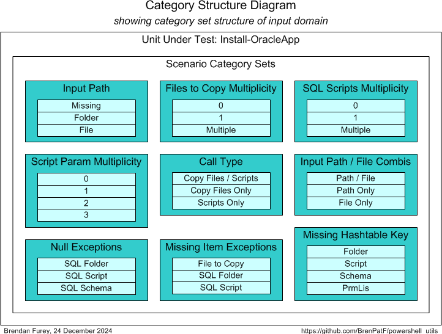

# powershell_utils/OracleUtils


> Powershell Oracle Utility module

This module contains a Powershell utility that facilitates installation of an Oracle database module comprising components such as tables, views, packages etc. by means of a set of SQL\*Plus scripts. These scripts have to be created separately for the particular Oracle module, while the Powershell utility coordinates their execution. The utility also allows for copying of files to a folder, such as a folder used for data loading via external tables.

Usage is demonstrated by an example from one of my GitHub Oracle projects, [Oracle PL/SQL General Utilities Module](https://github.com/BrenPatF/oracle_plsql_utils).

The module is tested using [The Math Function Unit Testing Design Pattern](https://brenpatf.github.io/2023/06/05/the-math-function-unit-testing-design-pattern.html), with test results in HTML and text format included.

# In This README...
[&darr; Usage](#usage)<br />
[&darr; API](#api)<br />
[&darr; Installation](#installation)<br />
[&darr; Unit Testing](#unit-testing)<br />
[&darr; Folder Structure](#folder-structure)<br />
[&darr; See Also](#see-also)<br />
## Usage
[&uarr; In This README...](#in-this-readme)<br />
[&darr; Driver Script - Install-Utils.ps1](#driver-script---install-utilsps1)<br />
[&darr; Script Output](#script-output)<br />
[&darr; SQL Logging](#sql-logging)<br />

To use this utility, you create a Powershell driver script that imports the module, sets up the input data in two Powershell objects, then calls the Install-OracleApp function. The return value contains logging information in the form of another Powershell object, and the there is a second entry point function, Write-OracleApp, that the returned object can be passed to in order to print the information.

In this section we'll show how it works by means of an example from one of my GitHub Oracle projects, [Oracle PL/SQL General Utilities Module](https://github.com/BrenPatF/oracle_plsql_utils).

### Example: Oracle PL/SQL General Utilities Module

#### Driver Script - Install-Utils.ps1
[&uarr; Usage](#usage)<br />
Here is the Powershell script that installs the module:

```powershell
Import-Module OracleUtils
$inputPath = 'c:/input'
$fileLis = @('./unit_test/tt_utils.purely_wrap_utils_inp.json',
             './fantasy_premier_league_player_stats.csv')

$sysSchema = 'sys'
$libSchema = 'lib'
$appSchema = 'app'

$sqlInstalls = @(@{folder = '.';                   script = 'drop_utils_users.sql';  schema = $sysSchema; prmLis = @($libSchema, $appSchema)},
               @{folder = '.';                     script = 'install_sys.sql';       schema = $sysSchema; prmLis = @($libSchema, $appSchema, $inputPath)},
               @{folder = 'lib';                   script = 'install_utils.sql';     schema = $libSchema; prmLis = @($appSchema)},
               @{folder = 'install_ut_prereq\lib'; script = 'install_lib_all.sql';   schema = $libSchema; prmLis = @($appSchema)},
               @{folder = 'install_ut_prereq\app'; script = 'c_syns_all.sql';        schema = $appSchema; prmLis = @($libSchema)},
               @{folder = 'lib';                   script = 'install_utils_tt.sql';  schema = $libSchema; prmLis = @()},
               @{folder = 'app';                   script = 'install_col_group.sql'; schema = $appSchema; prmLis = @($libSchema)},
               @{folder = '.';                     script = 'l_objects.sql';         schema = $sysSchema; prmLis = @($sysSchema)},
               @{folder = '.';                     script = 'l_objects.sql';         schema = $libSchema; prmLis = @($libSchema)},
               @{folder = '.';                     script = 'l_objects.sql';         schema = $appSchema; prmLis = @($appSchema)})

$fileCopies = [PSCustomObject]@{inputPath = $inputPath
                                fileLis = $fileLis}
$result = Install-OracleApp -fileCopies $fileCopies -sqlInstalls $sqlInstalls -testMode $false
Write-OracleApp $result
```

#### Script Output
[&uarr; Usage](#usage)<br />

```
Copy folder
===========

Copy folder = c:/input, existing = Y

Files copied...
===============

File
-----------------------------------------------
./unit_test/tt_utils.purely_wrap_utils_inp.json
./fantasy_premier_league_player_stats.csv

Sqlplus results
===============

subFolder              exeStr
---------------------  -------------------------------------------------------------------
.                      sqlplus sys/sys@orclpdb AS SYSDBA @drop_utils_users.sql lib app
.                      sqlplus sys/sys@orclpdb AS SYSDBA @install_sys.sql lib app c:/input
lib                    sqlplus lib/lib@orclpdb @install_utils.sql app
install_ut_prereq\lib  sqlplus lib/lib@orclpdb @install_lib_all.sql app
install_ut_prereq\app  sqlplus app/app@orclpdb @c_syns_all.sql lib
lib                    sqlplus lib/lib@orclpdb @install_utils_tt.sql
app                    sqlplus app/app@orclpdb @install_col_group.sql lib
.                      sqlplus sys/sys@orclpdb AS SYSDBA @l_objects.sql sys
.                      sqlplus lib/lib@orclpdb @l_objects.sql lib
.                      sqlplus app/app@orclpdb @l_objects.sql app
```

#### SQL Logging
[&uarr; Usage](#usage)<br />

The individual SQL\*Plus scripts may have their own logging to file using the SPOOL command as desired. In the example shown, the l_objects.sql script also lists database objects recently created in the specified schema.

The example folder structure contains examples of this kind of logging.
## API
[&uarr; In This README...](#in-this-readme)<br />
```powershell
Import-Module OracleUtils
```

### Install-OracleApp

```powershell
$result = Install-OracleApp -fileCopies $fileCopies -sqlInstalls $sqlInstalls -testMode $false
```

This function installs an Oracle database module comprising components such as tables, views, packages etc. The installation consists of two optional parts corresponding to the first two of the three input parameters:
* Copying of a list of files to a specified folder
* Running a set of SQL\*Plus scripts in specified folders against specified schemas

The parameters are:

* `[PSCustomObject]$fileCopies` - object with fields:
	* [string]inputPath - folder to which to copy the files
	* [string[]]fileLis - list of files to copy

* `[PSCustomObject[]]$sqlInstalls` - array of objects with fields:
	* [string]folder   - SQL script folder
	* [string]script   - SQL script name
	* [string]schema   - SQL script schema name
	* [string[]]prmLis - array of parameters to pass to SQL script

* `[bool]$testMode` - if true, executes the file copying and SQL\*Plus steps specified in the other parameters, else only logs the steps that would be taken

Return value:

* `[PSCustomObject]` - object with fields:
	* [PSCustomObject]fileCopy - object with fields:
		* [string]folder       - folder to which to copy the files
		* [string]folderExists - Y/N flag, Y if folder exists already
		* [string[]]fileLis    - list of files to copy
	* [PSCustomObject[]]appLis - array of objects with fields:
		* [string]subFolder    - SQL script subfolder
		* [string]exeStr       - SQL script execution string

### Write-OracleApp

```powershell
Write-OracleApp $result
```

This function prints the results of a call the previous function, using its return value as input.

The parameters are:

* `[PSCustomObject]$result` - object with same structure as return value of Install-OracleApp

## Installation
[&uarr; In This README...](#in-this-readme)<br />

To install OracleUtils open a powershell window in the OracleUtils root folder, and execute as follows:
```
$ .\Install-OracleUtils
```
This will create a folder OracleUtils under the first folder in your `psmodulepath` environment variable, and copy OracleUtils.psm1 to it.
## Unit Testing
[&uarr; In This README...](#in-this-readme)<br />
[&darr; Unit Testing Prerequisites](#unit-testing-prerequisites)<br />
[&darr; Unit Testing Process](#unit-testing-process)<br />
[&darr; Unit Test Results](#unit-test-results)<br />

### Unit Testing Prerequisites
[&uarr; Unit Testing](#unit-testing)<br />

The powershell package TrapitUtils is required to run the unit tests. This is a subproject of the same GitHub project as OracleUtils, so if you have downloaded it, you will already have it. The module is referenced using a relative path, so that it does not need to be installed explicitly.

The powershell package includes an npm package to format the unit test output JSON file in HTML and/or text, but you need to have [Node.js](https://nodejs.org/en/download) installed to run it.

### Unit Testing Process
[&uarr; Unit Testing](#unit-testing)<br />
[&darr; Step 1: Create Input Scenarios File](#step-1-create-input-scenarios-file)<br />
[&darr; Step 2: Create Results Object](#step-2-create-results-object)<br />
[&darr; Step 3: Format Results](#step-3-format-results)<br />
[&darr; Unit Test Driver Script](#unit-test-driver-script)<br />

The package is tested using [The Math Function Unit Testing Design Pattern](https://brenpatf.github.io/2023/06/05/the-math-function-unit-testing-design-pattern.html). In this approach, a 'pure' wrapper function is constructed that takes input parameters and returns a value, and is tested within a loop over scenario records read from a JSON file.

At a high level the Math Function Unit Testing design pattern involves three main steps:

1. Create an input file containing all test scenarios with input data and expected output data for each scenario
2. Create a results object based on the input file, but with actual outputs merged in, based on calls to the unit under test
3. Use the results object to generate unit test results files formatted in HTML and/or text


The first and third of these steps are supported by generic utilities that can be used in unit testing in any language. The second step uses a language-specific unit test driver utility.

In this case, where we have a Powershell function that coordinates the copying of files and the execution of Oracle SQL\*Plus scripts we have decided to exclude the actual copying and execution steps from unit testing. Instead, the function has been designed to log the actions, to be returned in a custom object, with a `testMode` parameter that allows the actions to be performed only when true. The testing will then check the values within the object.

However, the folders, files and scripts that arise within the test scenarios must be created where necessary within the test wrapper function, and deleted before returning. This allows for testing of validation steps.

#### Step 1: Create Input Scenarios File
[&uarr; Unit Testing Process](#unit-testing-process)<br />
[&darr; Unit Test Wrapper Function](#unit-test-wrapper-function)<br />
[&darr; Scenario Category ANalysis (SCAN)](#scenario-category-analysis-scan)<br />

##### Unit Test Wrapper Function
[&uarr; Step 1: Create Input Scenarios File](#step-1-create-input-scenarios-file)<br />

The diagram below shows the structure of the input and output of the wrapper function.


From the input and output groups depicted we can construct CSV files with flattened group/field structures, and default values added, as follows (with `install-oracleapp_inp.csv` left, `install-oracleapp_out.csv` right):


##### Scenario Category ANalysis (SCAN)
[&uarr; Step 1: Create Input Scenarios File](#step-1-create-input-scenarios-file)<br />
[&darr; Generic Category Sets](#generic-category-sets)<br />
[&darr; Categories and Scenarios](#categories-and-scenarios)<br />

The art of unit testing lies in choosing a set of scenarios that will produce a high degree of confidence in the functioning of the unit under test across the often very large range of possible inputs.

A useful approach to this can be to think in terms of categories of inputs, where we reduce large ranges to representative categories.  I explore this approach further in this article:

- [Unit Testing, Scenarios and Categories: The SCAN Method](https://brenpatf.github.io/2021/10/17/unit-testing-scenarios-and-categories-the-scan-method.html)

###### Generic Category Sets
[&uarr; Scenario Category ANalysis (SCAN)](#scenario-category-analysis-scan)<br />

As explained in the article mentioned above, it can be very useful to think in terms of generic category sets that apply in many situations.

###### *Multiplicity*

The generic category set of multiplicity is applicable very frequently, and we should check each of the relevant categories. In some cases we'll want to check Few / Many instance categories, but in this case we'll use None / One / Multiple.

| Code     | Description     |
|:--------:|:----------------|
| None     | No values       |
| One      | One value       |
| Multiple | Multiple values |

We apply this (with variations on categories) to:

- Files to copy
- SQL scripts
- Script parameters (0 / 1 / 2 / 3)

###### *Exceptions*

There are a number of possible error conditions that result in an exception being thrown. These include the following condition groups:

- Incorrect null values
- Missing items (files or folders)
- Missing input hashtable keys

###### Categories and Scenarios
[&uarr; Scenario Category ANalysis (SCAN)](#scenario-category-analysis-scan)<br />

After analysis of the possible scenarios in terms of categories and category sets, we can depict them on a Category Structure diagram:



We can tabulate the results of the category analysis, and assign a scenario against each category set/category with a unique description.

In some cases a category in one category set can be tested by a scenario designed to test a category in another set. In this design pattern it's extremely cheap to duplicate the scenario dataset, as a dataset is just an element in a JSON file, and we do this in a number of cases.

|  # | Category Set               | Category             | Scenario                   |
|---:|:---------------------------|:---------------------|:---------------------------|
|  1 | Input Path                 | Missing              | Path missing               |
|  2 | Input Path                 | Folder               | Path is folder             |
|  3 | Input Path                 | File                 | Path is file               |
|  4 | Files to Copy Multiplicity | 0                    | No file                    |
|  5 | Files to Copy Multiplicity | 1                    | One file                   |
|  6 | Files to Copy Multiplicity | Multiple             | Multiple files             |
|  7 | SQL Scripts Multiplicity   | 0                    | No SQL script              |
|  8 | SQL Scripts Multiplicity   | 1                    | One SQL script             |
|  9 | SQL Scripts Multiplicity   | Multiple             | Multiple SQL scripts       |
| 10 | Script Param Multiplicity  | 0                    | No script parameters       |
| 11 | Script Param Multiplicity  | 1                    | One script parameter       |
| 12 | Script Param Multiplicity  | 2                    | Two script parameters      |
| 13 | Script Param Multiplicity  | 3                    | Three script parameters    |
| 14 | Call Type                  | Copy Files / Scripts | Copy files and SQL scripts |
| 15 | Call Type                  | Copy Files Only      | Copy files only            |
| 16 | Call Type                  | Scripts Only         | SQL scripts only           |
| 17 | Input Path / File Combis   | Path / File          | Input path and files       |
| 18 | Input Path / File Combis   | Path Only            | Input path only            |
| 19 | Input Path / File Combis   | File Only            | Files only                 |
| 20 | Null Exceptions            | SQL Folder           | Null SQL folder            |
| 21 | Null Exceptions            | SQL Script           | Null SQL script            |
| 22 | Null Exceptions            | SQL Schema           | Null SQL schema            |
| 23 | Missing Item Exceptions    | File to Copy         | File to copy missing       |
| 24 | Missing Item Exceptions    | SQL Folder           | Install folder missing     |
| 25 | Missing Item Exceptions    | SQL Script           | Install script missing     |
| 26 | Missing Hashtable Key      | Folder               | Folder                     |
| 27 | Missing Hashtable Key      | Script               | Script                     |
| 28 | Missing Hashtable Key      | Schema               | Schema                     |
| 29 | Missing Hashtable Key      | PrmLis               | PrmLis                     |

From the scenarios identified we can construct the following CSV file (`install-oracleapp_sce.csv`), taking the category set and scenario columns, and adding an initial value for the active flag:


The API can be run with the following powershell in the folder of the CSV files:

###### *Format-JSON-InstallOracleApp.ps1*
```powershell
Import-Module ..\..\TrapitUtils\TrapitUtils.psm1
Write-UT_Template 'install-oracleapp' '|'
```
This creates the template JSON file, install-oracleapp_temp.json, which contains an element for each of the scenarios, with the appropriate category set and active flag, with a single record in each group with default values from the groups CSV files. The template file is then updated manually with data appropriate to each scenario.

#### Step 2: Create Results Object
[&uarr; Unit Testing Process](#unit-testing-process)<br />

Step 2 requires the writing of a wrapper function that is passed into a unit test library function, Test-Unit, via the entry point API,  `Test-Format`. Test-Unit reads the input JSON file, calls the wrapper function for each scenario, and writes the output JSON file with the actual results merged in along with the expected results.

##### purelyWrap-Unit
This is a listing of the wrapper function, which is included in the script Test-InstallOracleApp.ps1 and passed as a parameter to Test-Format.

```powershell
function purelyWrap-Unit($inpGroups) { # input scenario groups

    $inpPath, $inpType, $callType, $hashKey1, $hashKey2, $hashKey3, $hashKey4 = $inpGroups.'Scalars'[0].Split('|')
    if($inpType -eq 'File') {
        New-Item -Path "$inpPath" -ItemType File | Out-Null
    } elseif($inpType -eq 'Folder') {
        New-Item -Path "$inpPath" -ItemType Directory | Out-Null
    }
    $itemsToDelete = [string[]]@()
    if($inpType -eq 'File' -Or $inpType -eq 'Folder') {
        $itemsToDelete = @($inpPath)
    }
    [string[]]$fileLis = @()
    [string[]]$copyFilesLis = $inpGroups.'Copy Files'
    $copyFilesLis | %{
        $fileName, $existsYN = $_.Split('|')
        $fileLis += $fileName
        if($existsYN -eq 'Y') {
            New-Item -Path ".\$fileName" -ItemType File | Out-Null
            $itemsToDelete += ".\$fileName"
        }
    }
    $installObjLis = [PSCustomObject[]]@()
    [string[]]$installLis = $inpGroups.'SQL Install List'
    $installLis | %{
        $folderNm, $folderExistsYN, $scriptNm, $scriptExistsYN, $schema, $prm1, $prm2, $prm3 = $_.Split('|')
        if($folderExistsYN -eq 'Y' -And $folderNm -ne '.') {
            if (-Not (Test-Path -PathType Container $folderNm)) {
                New-Item -Path "$folderNm" -ItemType Directory | Out-Null
                $itemsToDelete += "$folderNm"
            }
        }
        if(($folderExistsYN -eq 'Y') -And ($scriptExistsYN -eq 'Y')) {
            New-Item -Path ("$folderNm\$scriptNm") -ItemType File | Out-Null
            if($folderNm -eq '.') {
                $itemsToDelete += "$folderNm\$scriptNm"
            }
        }
        $prmLis = [string[]]@()
        if($prm1 -ne '') {
            $prmLis += $prm1
            if($prm2 -ne '') {
                $prmLis += $prm2
                if($prm3 -ne '') {
                    $prmLis += $prm3
                }
            }
        }
        $installObjLis += @{
            $hashKey1 = $folderNm
            $hashKey2 = $scriptNm
            $hashKey3 = $schema
            $hashKey4 = $prmLis
        }
    }
    $exceptionLis = [string[]]@()
    try {
        $fileCopies = [PSCustomObject]@{inputPath = $inpPath; fileLis = $fileLis}
        if($callType -eq 'File') {
            $result = Install-OracleApp -fileCopies $fileCopies -testMode $true
        } elseif($callType -eq 'SQL') {
            $result = Install-OracleApp -sqlInstalls $installObjLis -testMode $true
        } else {
            $result = Install-OracleApp -fileCopies $fileCopies -sqlInstalls $installObjLis -testMode $true
        }
        $fc = $result.fileCopy
        $inputPathLis = [string[]]@()
        if($fc) {
            $inputPathLis = @($fc.folderExists)
            $copyFilesLis = [string[]]$fc.fileLis
        }
        $installOutLis = [string[]]@()
        $al = $result.appLis
        if($al){
            foreach($a in $al) {
                $installOutLis += $a.subFolder + '|' + $a.exeStr
            }
        }
    } catch {
        $inputPathLis  = [string[]]@()
        $copyFilesLis  = [string[]]@()
        $installOutLis = [string[]]@()
        $exceptionLis  = [string[]]@(,$_)
    }
    foreach($i in $itemsToDelete) {
        Remove-Item $i -Force -Recurse
    }
    [PSCustomObject]@{
          'Input Path'       = $inputPathLis
          'Copy Files'       = $copyFilesLis
          'SQL Install List' = $installOutLis
          'Exception'        = $exceptionLis
    }
}
```

#### Step 3: Format Results
[&uarr; Unit Testing Process](#unit-testing-process)<br />

Step 3 involves formatting the results contained in the JSON output file from step 2, via the JavaScript formatter:

```powershell
    node ($npmRoot + '/node_modules/trapit/externals/format-external-file') $jsonFile
```

This step is executed within the TrapitUtils entry point API, `Test-Format`.

#### Unit Test Driver Script
[&uarr; Unit Testing Process](#unit-testing-process)<br />

Unit testing is executed through a driver script, Test-InstallOracleApp.ps1, that contains the wrapper function and makes a call to the TrapitUtils library function `Test-Format`. This calls Test-Unit to create the output JSON file, and then calls the Javascript formatter, which writes the formatted results files to a subfolder in the script folder, with name based on the title, returning a summary of the results.

`Test-Format` has parameters:

* `[string]$utRoot`: unit test root folder
* `[string]$npmRoot`: parent folder of the JavaScript node_modules npm root folder
* `[string]$stemInpJSON`: input JSON file name stem
* `[ScriptBlock]$purelyWrapUnit`: function to process unit test for a single scenario

Return value:

* `[string]`: summary of results

###### Test-InstallOracleApp.ps1

```powershell
Import-Module ..\..\Utils\Utils.psm1, ..\..\OracleUtils\OracleUtils.psm1, ..\..\TrapitUtils\TrapitUtils.psm1
function purelyWrap-Unit($inpGroups) { # input scenario groups
    ...
}
Test-Format $PSScriptRoot ($PSScriptRoot + '/../../TrapitUtils') 'install-oracleapp' ${function:purelyWrap-Unit}
```
This script creates a results subfolder, with results in text and HTML formats, in the script folder, and outputs the following summary:

```
Results summary for file: install-oracleapp_out.json
====================================================

File:          install-oracleapp_out.json
Title:         Install-OracleApp
Inp Groups:    3
Out Groups:    5
Tests:         29
Fails:         0
Folder:        install-oracleapp
```

### Unit Test Results
[&uarr; Unit Testing](#unit-testing)<br />
[&darr; Unit Test Report - install-oracleapp](#unit-test-report---install-oracleapp)<br />
[&darr; Scenario 13: Three script parameters [Category Set: Script Param Multiplicity]](#scenario-13-three-script-parameters-category-set-script-param-multiplicity)<br />

Here we show screenshots of the scenario-level summary of results, and the results page for scenario 13.

You can review the full HTML formatted unit test results here:

- [Unit Test Report: install-oracleapp](http://htmlpreview.github.io/?https://github.com/BrenPatF/powershell_utils/blob/master/OracleUtils/unit_test/install-oracleapp/install-oracleapp.html)

Next we show the scenario-level summary of results, followed by the results page for scenario 13.

##### Unit Test Report - install-oracleapp
[&uarr; Unit Test Results](#unit-test-results)<br />

Here is the results summary in HTML format:


##### Scenario 13: Three script parameters [Category Set: Script Param Multiplicity]
[&uarr; Unit Test Results](#unit-test-results)<br />

Here is the results page for scenario 13 in HTML format:

## Folder Structure
[&uarr; In This README...](#in-this-readme)<br />

The project folder structure is shown below.


There are three subfolders below the OracleUtils root folder, which has README and module:
- `example`: Example of use (oracle_plsql_utils)
- `png`: This holds the image files for the README
- `unit_test`: Root folder for unit testing of the package, with subfolder having the results files

## See Also
[&uarr; In This README...](#in-this-readme)<br />
- [The Math Function Unit Testing Design Pattern](https://brenpatf.github.io/2023/06/05/the-math-function-unit-testing-design-pattern.html)
- [Unit Testing, Scenarios and Categories: The SCAN Method](https://brenpatf.github.io/jekyll/update/2021/10/17/unit-testing-scenarios-and-categories-the-scan-method.html)
- [Powershell Trapit Unit Testing Utilities Module](https://github.com/BrenPatF/powershell_utils/tree/master/TrapitUtils)
- [Trapit - JavaScript Unit Tester/Formatter](https://github.com/BrenPatF/trapit_nodejs_tester)
- [Node.js Downloads](https://nodejs.org/en/download)
- [Oracle PL/SQL General Utilities Module](https://github.com/BrenPatF/oracle_plsql_utils)
- [Powershell General Utilities Module](https://github.com/BrenPatF/powershell_utils/tree/master/Utils)
- [Powershell Oracle Utility Module](https://github.com/BrenPatF/powershell_utils/tree/master/OracleUtils)

## Software Versions

- Windows 11
- Powershell 7
- npm 6.13.4
- Node.js v12.16.1

## License
MIT
