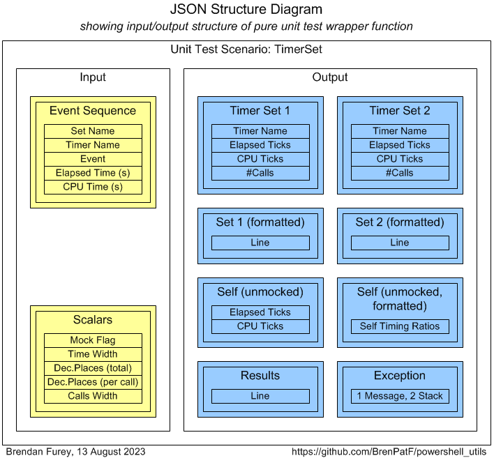
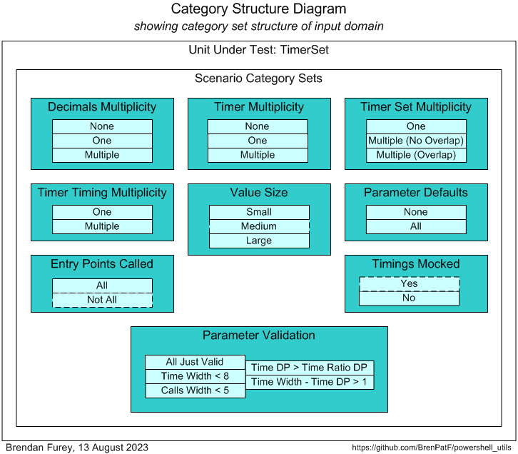
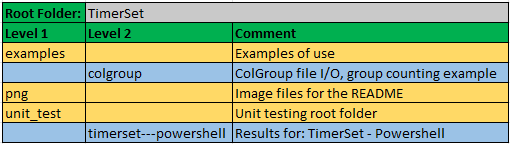

# powershell_utils/TimerSet


> Powershell Code Timing module

:stopwatch:

This module facilitates code timing for instrumentation and other purposes, with very small footprint in both code and resource usage. Construction and reporting require only a single line of code each, regardless of how many timers are included in a set, and usually only a single timing line is needed per section timed.

Multiple timer sets can be created and run independently, allowing for timing at multiple levels simultaneously, and for use across multiple modules without conflicts.

See [Code Timing and Object Orientation and Zombies](http://www.scribd.com/doc/43588788/Code-Timing-and-Object-Orientation-and-Zombies), November 2010, for the original idea implemented in Oracle PL/SQL, Perl and Java.

Usage is demonstrated by an example calling a simple file-reading and group-counting package.

The module is tested using [The Math Function Unit Testing Design Pattern](https://brenpatf.github.io/2023/06/05/the-math-function-unit-testing-design-pattern.html), with test results in HTML and text format included.

# In this README...
[&darr; Usage](#usage)<br />
[&darr; API](#api)<br />
[&darr; Installation](#installation)<br />
[&darr; Unit Testing](#unit-testing)<br />
[&darr; Folder Structure](#folder-structure)<br />
[&darr; See Also](#see-also)<br />
## Usage
[&uarr; In this README...](#in-this-readme)<br />

There is a script with an example of use of the TimerSet class to time calls to a demo class ColGroup. The scripts and output logs can be found in the `examples/colgroup` folder.

### Show-ColGroup.ps1
```powershell
Using Module './ColGroup.psm1'
Using Module TimerSet
$INPUT_FILE, $DELIM, $COL = ($PSScriptRoot + '/fantasy_premier_league_player_stats.csv'), ',', 'team_name'

$ts = [TimerSet]::New('Example Timer Set')
$grp = [ColGroup]::New($INPUT_FILE, $DELIM, $COL)
$ts.incrementTime('ColGroup constructor')

$grp.WriteList('(as is)', $grp.ListAsIs())
$ts.incrementTime('ListAsIs')
$grp.WriteList('key',     $grp.SortByKey())
$ts.incrementTime('SortByKey')
$grp.WriteList('value',   $grp.SortByValue())
$ts.incrementTime('SortByValue')

$ts.formatResults()
```

This will create a timer set and time the sections, with listing at the end:

```
Timer set: Example Timer Set, constructed at 2024-11-26 07:13:53, written at 2024-11-26 07:14:00
================================================================================================

Timer                  Elapsed       CPU   Calls     Ela/Call     CPU/Call
--------------------  --------  --------  ------  -----------  -----------
ColGroup constructor      7.15      3.03       1      7.14954      3.03125
ListAsIs                  0.03      0.00       1      0.02909      0.00000
SortByKey                 0.01      0.00       1      0.00676      0.00000
SortByValue               0.00      0.00       1      0.00449      0.00000
(Other)                   0.01      0.00       1      0.01366      0.00000
--------------------  --------  --------  ------  -----------  -----------
Total                     7.20      3.03       5      1.44071      0.60625
--------------------  --------  --------  ------  -----------  -----------
[Timer timed (per call in ms): Elapsed: 0.13983, CPU: 0.06510]
```

To run the example script, open a powershell window in the `examples/colgroup` folder and execute as follows (after installing the TimerSet module):

```
$ ./Show-ColGroup
```

It's worth noting here that in earlier versions of Powershell than used here, the times recorded were much longer, as can be seen from the git history, and although different PCs were used, that does not fully account for the differences. It seems that Powershell used to be extremely slow compared with other languages, but that its performance has recently been much improved.
## API
[&uarr; In this README...](#in-this-readme)<br />
[&darr; New (real timings)](#new-real-timings)<br />
[&darr; New (mocked timings)](#new-mocked-timings)<br />
[&darr; incrementTime](#incrementtime)<br />
[&darr; initTime](#inittime)<br />
[&darr; getTimers](#gettimers)<br />
[&darr; formatTimers (with parameters)](#formattimers-with-parameters)<br />
[&darr; formatTimers (without parameters)](#formattimers-without-parameters)<br />
[&darr; getSelfTimer](#getselftimer)<br />
[&darr; formatSelfTimer (with parameters)](#formatselftimer-with-parameters)<br />
[&darr; formatSelfTimer (without parameters)](#formatselftimer-without-parameters)<br />
[&darr; formatResults (with parameters)](#formatresults-with-parameters)<br />
[&darr; formatResults (without parameters)](#formatresults-without-parameters)<br />

```powershell
Using Module TimerSet
```

### New (real timings)
[&uarr; API](#api)<br />
```powershell
$ts = [TimerSet]::New($timerSetName)
```
Constructs a new timer set `$ts` with name `$timerSetName`, using real timings, with parameters:

* `$timerSetName`: timer set name

Return value:

* `[TimerSet]`: TimerSet object handle

### New (mocked timings)
[&uarr; API](#api)<br />
```powershell
$ts = [TimerSet]::New($timerSetName, $p_getEla, $p_getCpu)
```
Constructs a new timer set `$ts` with name `$timerSetName`, using mocked timings, with parameters:

* `[string]$timerSetName`: timer set name
* `[ScriptBlock]$p_getEla`: script block to get mocked elapsed time
* `[ScriptBlock]$p_getCpu`: script block to get mocked CPU time

Return value:

* `[TimerSet]`: TimerSet object handle

### incrementTime
[&uarr; API](#api)<br />
```powershell
$ts.incrementTime([string]$timerName)
```
Increments the timing statistics (elapsed time, CPU time, and number of calls) for a timer `$timerName` within the timer set `$ts` with the times passed since the previous call to increment_time, initTime or the constructor of the timer set instance. Resets the statistics for timer set `$ts` to the current time, so that the next call to increment_time measures from this point for its increment. Parameters:

* `$timerName`: timer name

### initTime
[&uarr; API](#api)<br />
```powershell
$ts.initTime()
```
Resets the statistics for timer set `$ts` to the current time, so that the next call to incrementTime measures from this point for its increment. This is only used where there are gaps between sections to be timed.

### getTimers
[&uarr; API](#api)<br />
```powershell
$ts.getTimers()
```
Returns the results for timer set `$ts` in an array of hashtables:

After a record for each named timer, in order of creation, there are two calculated records:

* `Other`: differences between `Total` values and the sums of the named timers
* `Total`: totals calculated from the times at timer set construction

Return value:

* `[hashtable[]]`: array of hashtables with fields:
	* `[string]timer`: timer name
	* `[long]ela`: elapsed time in ticks
	* `[long]cpu`: CPU time in s
	* `[int]calls`: number of calls

### formatTimers (with parameters)
[&uarr; API](#api)<br />
```powershell
$ts.formatTimers($timeWidth, $timeDP, $timeRatioDP, $callsWidth)
```
Returns the results for timer set `$ts` in an array of formatted strings, including column headers and formatting lines, with fields as in getTimers, times in seconds, and per call values added, with parameters:

* `[int]$timeWidth`: width of time fields
* `[int]$timeDP`: decimal places to show for absolute time fields
* `[int]$timeRatioDP`: decimal places to show for per call time fields
* `[int]$callsWidth`: width of calls field

Return value:

* `[string[]]`: array of formatted strings with timer name and timing fields embedded

### formatTimers (without parameters)
[&uarr; API](#api)<br />
```powershell
$ts.formatTimers()
```
Returns the results for timer set `$ts` in an array of formatted strings, including column headers and formatting lines, with fields as in getTimers, times in seconds, and per call values added, by calling formatTimers (with parameters) with parameters set to default values:

* `[int]$timeWidth`: width of time fields (excluding decimal places), default 8
* `[int]$timeDP`: decimal places to show for absolute time fields, default 2
* `[int]$timeRatioDP`: decimal places to show for per call time fields, default 5
* `[int]$callsWidth`: width of calls field, default 6

Return value:

* `[string[]]`: array of formatted strings with timer name and timing fields embedded

### getSelfTimer
[&uarr; API](#api)<br />
```powershell
[TimerSet]::getSelfTimer()
```
Static method to time the incrementTime method as a way of estimating the overhead in using the timer set. Constructs a timer set instance and calls incrementTime on it within a loop until 0.1s has elapsed.

Return value:

* `[PSObject]`: object with elapsed and CPU times per call in milliseconds:
	* `[float]ela`: elapsed time per call in milliseconds
	* `[float]cpu`: cpu time per call in milliseconds

### formatSelfTimer (with parameters)
[&uarr; API](#api)<br />
```powershell
[TimerSet]::formatSelfTimer($timeWidth, $timeDP, $timeRatioDP)
```
Static method to return the results from getSelfTimer in a formatted string, with parameters:

* `[int]$time_width`: width of time fields
* `[int]$time_dp`: decimal places to show for absolute time fields
* `[int]$time_ratio_dp`: decimal places to show for per call time fields

Return value:

* `[string]`: string with elapsed and CPU times per call in milliseconds

### formatSelfTimer (without parameters)
[&uarr; API](#api)<br />
```powershell
[TimerSet]::formatSelfTimer()
```
Static method to return the results from getSelfTimer in a formatted string, by calling formatTimers (with parameters) with parameters set to default values:

* `[int]$time_width`: width of time fields (excluding decimal places), default 8
* `[int]$time_dp`: decimal places to show for absolute time fields, default 2
* `[int]$time_ratio_dp`: decimal places to show for per call time fields, default 5

Return value:

* `[string]`: string with elapsed and CPU times per call in milliseconds

### formatResults (with parameters)
[&uarr; API](#api)<br />
```powershell
$ts.formatResults($timeWidth, $timeDP, $timeRatioDP, $callsWidth)
```
Returns the results for timer set `$ts` in a formatted string, with parameters as formatTimers. It uses the array returned from formatTimers and includes a header line with timer set construction and writing times, and a footer of the self-timing values.

* `[int]$timeWidth`: width of time fields
* `[int]$timeDP`: decimal places to show for absolute time fields
* `[int]$timeRatioDP`: decimal places to show for per call time fields
* `[int]$callsWidth`: width of calls field

Return value:

* `[string]`: string with tabulated results

### formatResults (without parameters)
[&uarr; API](#api)<br />
```powershell
$ts.formatResults()
```
Returns the results for timer set `$ts` in a formatted string by calling formatResults (with parameters) with parameters set to default values:

* `[int]$timeWidth`: width of time fields (excluding decimal places), default 8
* `[int]$timeDP`: decimal places to show for absolute time fields, default 2
* `[int]$timeRatioDP`: decimal places to show for per call time fields, default 5
* `[int]$callsWidth`: width of calls field, default 6

Return value:

* `[string]`: string with tabulated results

## Installation
[&uarr; In this README...](#in-this-readme)<br />
[&darr; Installation Prerequisites](#installation-prerequisites)<br />
[&darr; Install TimerSet](#install-timerset)<br />

### Installation Prerequisites
[&uarr; Installation](#installation)<br />

The powershell package Utils is required. This is a subproject of the same GitHub project as TimerSet, so if you have downloaded the project, you will already have it, and it will be installed automatically as part of the TimerSet installation.

### Install TimerSet
[&uarr; Installation](#installation)<br />

To install TimerSet open a powershell window in the root TimerSet folder, and execute as follows:
```powershell
$ ./Install-TimerSet
```
This will create a folder TimerSet under the first folder in your `PSModulePath` environment variable, and copy TimerSet.psm1 to it.

It will also create a folder for the prerequisite module, Utils, under the first folder in your `PSModulePath` environment variable, and copy Utils.psm1 to it.
## Unit Testing
[&uarr; In this README...](#in-this-readme)<br />
[&darr; Unit Testing Prerequisites](#unit-testing-prerequisites)<br />
[&darr; Unit Testing Process](#unit-testing-process)<br />
[&darr; Unit Test Results](#unit-test-results)<br />

### Unit Testing Prerequisites
[&uarr; Unit Testing](#unit-testing)<br />

The powershell module TrapitUtils is required to run the unit tests. This is a subproject of the same GitHub project as Utils, so if you have downloaded it, you will already have it. The module is referenced using a relative path, so that it does not need to be installed explicitly.

The module includes an npm package to format the unit test output JSON file in HTML and/or text, but you need to have [Node.js](https://nodejs.org/en/download) installed to run it.

### Unit Testing Process
[&uarr; Unit Testing](#unit-testing)<br />
[&darr; Step 1: Create Input Scenarios File](#step-1-create-input-scenarios-file)<br />
[&darr; Step 2: Create Results Object](#step-2-create-results-object)<br />
[&darr; Step 3: Format Results](#step-3-format-results)<br />
[&darr; Unit Test Driver Script](#unit-test-driver-script)<br />

The package is tested using [The Math Function Unit Testing Design Pattern](https://brenpatf.github.io/2023/06/05/the-math-function-unit-testing-design-pattern.html). In this approach, a 'pure' wrapper function is constructed that takes input parameters and returns a value, and is tested within a loop over scenario records read from a JSON file.

The wrapper function represents a generalised transactional use of the package in which multiple timer sets may be constructed, and then timings carried out and reported on at the end of the transaction.

This kind of package would usually be thought hard to unit-test, with CPU and elapsed times being inherently non-deterministic. However, this is a good example of the power of the design pattern: One of the inputs is a yes/no flag indicating whether to mock the system timing calls, or not. One of the two overloaded constructor methods takes as parameters script blocks that return mocked elapsed and CPU times read from the input scenario data.

In the non-mocked scenarios standard function calls are made to return epochal elapsed and CPU times, while in the mocked scenarios these are bypassed, and deterministic values passed from the script blocks.

In this way we can test correctness of the timing aggregations, independence of timer sets etc. using the deterministic values; on the other hand, one of the key benefits of automated unit testing is to test the actual dependencies, and we do this in the non-mocked case by passing in 'sleep' times to the wrapper function and testing the outputs against ranges of values.

At a high level the Math Function Unit Testing design pattern involves three main steps:

1. Create an input file containing all test scenarios with input data and expected output data for each scenario
2. Create a results object based on the input file, but with actual outputs merged in, based on calls to the unit under test
3. Use the results object to generate unit test results files formatted in HTML and/or text


The first and third of these steps are supported by generic utilities that can be used in unit testing in any language. The second step uses a language-specific unit test driver utility.

#### Step 1: Create Input Scenarios File
[&uarr; Unit Testing Process](#unit-testing-process)<br />
[&darr; Unit Test Wrapper Function](#unit-test-wrapper-function)<br />
[&darr; Scenario Category ANalysis (SCAN)](#scenario-category-analysis-scan)<br />

##### Unit Test Wrapper Function
[&uarr; Step 1: Create Input Scenarios File](#step-1-create-input-scenarios-file)<br />

The diagram below shows the structure of the input and output of the wrapper function.



From the input and output groups depicted we can construct CSV files with flattened group/field structures, and default values added, as follows (with `timerset_ps_inp.csv` left, `timerset_ps_out.csv` right):


These form two of the three input files for the Powershell script that generates a template for the input JSON file. The third is the scenarios file, shown in the next section.

##### Scenario Category ANalysis (SCAN)
[&uarr; Step 1: Create Input Scenarios File](#step-1-create-input-scenarios-file)<br />
[&darr; Generic Category Sets](#generic-category-sets)<br />
[&darr; Categories and Scenarios](#categories-and-scenarios)<br />

The art of unit testing lies in choosing a set of scenarios that will produce a high degree of confidence in the functioning of the unit under test across the often very large range of possible inputs.

A useful approach to this can be to think in terms of categories of inputs, where we reduce large ranges to representative categories.  I explore this approach further in this article:

- [Unit Testing, Scenarios and Categories: The SCAN Method](https://brenpatf.github.io/2021/10/17/unit-testing-scenarios-and-categories-the-scan-method.html)

###### Generic Category Sets
[&uarr; Scenario Category ANalysis (SCAN)](#scenario-category-analysis-scan)<br />

As explained in the article mentioned above, it can be very useful to think in terms of generic category sets that apply in many situations.

###### *Multiplicity*

The generic category set of multiplicity is applicable very frequently, and we should check each of the relevant categories. In some cases we'll want to check Few / Many instance categories, but in this case we'll use None / One / Multiple.

| Code     | Description     |
|:--------:|:----------------|
| None     | No values       |
| One      | One value       |
| Multiple | Multiple values |

- Decimals: Number of decimal places
- Timers: Number of timers in a set
- Timer Sets: Number of timer sets (excluding None as in that case there's nothing to test, and splitting Multiple into two sub-categories)
- Timer Timings: Number of timings made for a given timer (One and Mulitple only as a timer is only defined at its first call)

###### *Binary*

There are many situations where a category set splits into two opposing values such as Yes / No or True / False.

| Code | Description     |
|:----:|:----------------|
| Yes  | Yes / True etc. |
| No   | No / False etc. |

We apply this to:

- Parameter Defaults
- Entry Points Called
- Timings Mocked

###### *Size*

We may wish to check that functions work correctly for both large and small parameter or other data values.

| Code   | Description  |
|:------:|:-------------|
| Small  | Small values |
| Large  | Large values |

We apply this here to the timing values, in the mocked case.

###### Categories and Scenarios
[&uarr; Scenario Category ANalysis (SCAN)](#scenario-category-analysis-scan)<br />

After analysis of the possible scenarios in terms of categories and category sets, we can depict them on a Category Structure diagram:



We can tabulate the results of the category analysis, and assign a scenario against each category set/category with a unique description:


|  # | Category Set              | Category                  | Scenario (* = implicitly tested via other scenarios) |
|---:|:--------------------------|:--------------------------|:-----------------------------------------------------|
|  1 | Timer Timing Multiplicity | One                       | One timing for a timer                               |
|  2 | Timer Timing Multiplicity | Multiple                  | Multiple timings for a timer                         |
|  3 | Timer Multiplicity        | None                      | No timer in timer set                                |
|  4 | Timer Multiplicity        | One                       | One timer in timer set                               |
|  5 | Timer Multiplicity        | Multiple                  | Multiple timers in timer set                         |
|  6 | Timer Set Multiplicity    | One                       | One timer set                                        |
|  7 | Timer Set Multiplicity    | Multiple (No Overlap)     | Multiple non-overlapping timer sets                  |
|  8 | Timer Set Multiplicity    | Multiple (Overlap)        | Multiple timer sets with overlapping                 |
|  9 | Decimals Multiplicity     | None                      | No decimal places                                    |
| 10 | Decimals Multiplicity     | One                       | One decimal place                                    |
| 11 | Decimals Multiplicity     | Multiple                  | Multiple decimal places                              |
| 12 | Value Size                | Small                     | Small values                                         |
| 13 | Value Size                | Medium                    | Medium values                                        |
| 14 | Value Size                | Large                     | Large values                                         |
| 15 | Parameter Defaults        | None                      | None defaulted                                       |
| 16 | Parameter Defaults        | All                       | All defaulted                                        |
| 17 | Entry Points Called       | All                       | All entry points called                              |
|  * | Entry Points Called       | Not All                   | (Not all entry points called)*                       |
|  * | Timings Mocked            | Yes                       | (Timings mocked)*                                    |
| 18 | Timings Mocked            | No                        | Timings real                                         |
| 19 | Parameter Validation      | All Just Valid            | All parameters just valid                            |
| 20 | Parameter Validation      | Time Width < 8            | Parameter invalid: Time Width < 8                    |
| 21 | Parameter Validation      | Time DP > Time Ratio DP   | Parameter invalid: Time DP > Time ratio DP           |
| 22 | Parameter Validation      | Time Width - Time DP > 1  | Parameter invalid: Time Width - Time DP > 1          |
| 23 | Parameter Validation      | Calls width < 5           | Parameter invalid: Calls width < 5                   |

From the scenarios identified we can construct the following CSV file (`timerset_ps_sce.csv`), taking the category set and scenario columns, and adding an initial value for the active flag:


The API can be run with the following powershell in the folder of the CSV files:

###### *Format-JSON-Utils.ps1*
```powershell
Import-Module ..\..\TrapitUtils\TrapitUtils.psm1
Write-UT_Template 'timerset_ps' '|'
```
This creates the template JSON file, timerset_ps_temp.json, which contains an element for each of the scenarios, with the appropriate category set and active flag, with a single record in each group with default values from the groups CSV files. The template file is then updated manually with data appropriate to each scenario.

#### Step 2: Create Results Object
[&uarr; Unit Testing Process](#unit-testing-process)<br />

Step 2 requires the writing of a wrapper function that is passed into a unit test library function, Test-Unit, via the entry point API,  `Test-Format`. Test-Unit reads the input JSON file, calls the wrapper function for each scenario, and writes the output JSON file with the actual results merged in along with the expected results.

##### purelyWrap-Unit (skeleton)
This is a skeleton listing of the wrapper function, which is included in the script Test-TimerSet.ps1 and passed as a parameter to Test-Format.
```powershell
function purelyWrap-Unit([PSCustomObject]$inpGroups) {# json object for a single scenario, with inputs
...
    [PSCustomObject]@{
                $TIMER_SET_1    = $outArr[$TIMER_SET_1]
                $TIMER_SET_1_F  = $outArrF[$TIMER_SET_1]
                $TIMER_SET_2    = $outArr[$TIMER_SET_2]
                $TIMER_SET_2_F  = $outArrF[$TIMER_SET_2]
                $SELF_GRP       = $selfTimer
                $SELF_GRP_F     = $selfTimerF
                $RES_GRP        = $results
                $EXCEPTION      = $exceptions
    }
}
```

#### Step 3: Format Results
[&uarr; Unit Testing Process](#unit-testing-process)<br />

Step 3 involves formatting the results contained in the JSON output file from step 2, via the JavaScript formatter:

```powershell
    node ($npmRoot + '/node_modules/trapit/externals/format-external-file') $jsonFile
```

This step is executed within the TrapitUtils entry point API, `Test-Format`.

#### Unit Test Driver Script
[&uarr; Unit Testing Process](#unit-testing-process)<br />

Unit testing is executed through a driver script, Test-TimerSet.ps1, that contains the wrapper function and makes a call to the TrapitUtils library function `Test-Format`. This calls Test-Unit to create the output JSON file, and then calls the Javascript formatter, which writes the formatted results files to a subfolder in the script folder, with name based on the title, returning a summary of the results.

`Test-Format` has parameters:

* `[string]$utRoot`: unit test root folder
* `[string]$npmRoot`: parent folder of the JavaScript node_modules npm root folder
* `[string]$stemInpJSON`: input JSON file name stem
* `[ScriptBlock]$purelyWrapUnit`: function to process unit test for a single scenario

Return value:

* `[string]`: summary of results

##### Test-TimerSet.ps1

```powershell
Using Module ..\..\TimerSet\TimerSet.psm1
Import-Module ..\..\Utils\Utils.psm1, ..\..\TrapitUtils\TrapitUtils.psm1
...
function purelyWrap-Unit($inpGroups) { # input scenario groups
    ...
}
Test-Format $PSScriptRoot ($PSScriptRoot + '/../../TrapitUtils') 'timerset_ps' ${function:purelyWrap-Unit}
```
This script creates a results subfolder, with results in text and HTML formats, in the script folder, and outputs the following summary:

```
Results summary for file: C:/Users/Brend/Dropbox/Home/WIP/powershell_utils/TimerSet/unit_test/timerset_ps_out.json
==================================================================================================================

File:          timerset_ps_out.json
Title:         TimerSet - Powershell
Inp Groups:    2
Out Groups:    9
Tests:         23
Fails:         0
Folder:        timerset---powershell
```

### Unit Test Results
[&uarr; Unit Testing](#unit-testing)<br />
[&darr; Unit Test Report - TimerSet - Powershell](#unit-test-report---timerset---powershell)<br />
[&darr; Scenario 8: Multiple timer sets with overlapping [Category Set: Timer Set Multiplicity]](#scenario-8-multiple-timer-sets-with-overlapping-category-set-timer-set-multiplicity)<br />

Here we show screenshots of the scenario-level summary of results, and the results page for scenario 8.

You can review the full HTML formatted unit test results here:

- [Unit Test Report: Powershell Utils](http://htmlpreview.github.io/?https://github.com/BrenPatF/powershell_utils/blob/master/TimerSet/unit_test/powershell-utils/powershell-utils.html)

##### Unit Test Report - TimerSet - Powershell
[&uarr; Unit Test Results](#unit-test-results)<br />

Here is the results summary in HTML format:


##### Scenario 8: Multiple timer sets with overlapping [Category Set: Timer Set Multiplicity]
[&uarr; Unit Test Results](#unit-test-results)<br />

Here is the results page for scenario 8 in HTML format:


## Folder Structure
[&uarr; In this README...](#in-this-readme)<br />

The project folder structure is shown below.



There are three subfolders below the TimerSet root folder, which has README and module:
- `examples`: Examples of use, with a single subfolder for the ColGroup file I/O, group counting example
- `png`: This holds the image files for the README
- `unit_test`: Root folder for unit testing of the package, with subfolder having the results files

## See Also
[&uarr; In this README...](#in-this-readme)<br />
- [Code Timing and Object Orientation and Zombies](http://www.scribd.com/doc/43588788/Code-Timing-and-Object-Orientation-and-Zombies)
- [The Math Function Unit Testing Design Pattern](https://brenpatf.github.io/2023/06/05/the-math-function-unit-testing-design-pattern.html)
- [Trapit - JavaScript Unit Tester/Formatter](https://github.com/BrenPatF/trapit_nodejs_tester)
- [Unit Testing, Scenarios and Categories: The SCAN Method](https://brenpatf.github.io/2021/10/17/unit-testing-scenarios-and-categories-the-scan-method.html)
- [Powershell Trapit Unit Testing Utilities Module](https://github.com/BrenPatF/powershell_utils/tree/master/TrapitUtils)
- [Node.js Downloads](https://nodejs.org/en/download)
- [Powershell General Utilities Module](https://github.com/BrenPatF/powershell_utils/tree/master/Utils)
- [Oracle PL/SQL Timer Set Module](https://github.com/BrenPatF/timer_set_oracle)
- [Python Timer Set Module](https://github.com/BrenPatF/timerset_python)
- [JavaScript Timer Set Module](https://github.com/BrenPatF/timer-set-nodejs)
- [Powershell Timer Set Module](https://github.com/BrenPatF/powershell_utils/tree/master/TimerSet)

## Software Versions

- Windows 11
- Powershell 7
- npm 6.13.4
- Node.js v12.16.1

## License
MIT
