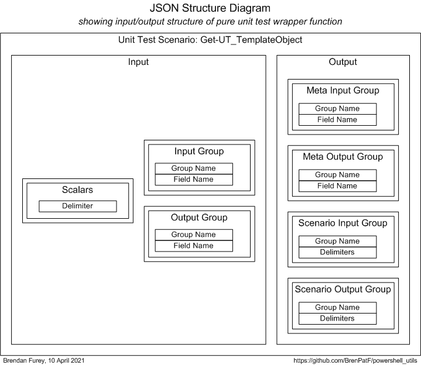

# powershell_utils/TrapitUtils
Powershell Trapit unit testing utilities module.

:hammer_and_wrench: :detective:

This module comprises a set of powershell utility functions for unit testing following the Math Function Unit Testing design pattern.

I explained the concepts for this design pattern in relation specifically to database testing in a presentation at the Oracle User Group Ireland Conference in March 2018:

- [The Database API Viewed As A Mathematical Function: Insights into Testing](https://www.slideshare.net/brendanfurey7/database-api-viewed-as-a-mathematical-function-insights-into-testing)

I later named the approach 'The Math Function Unit Testing design pattern' when I applied it in Javascript and wrote a Javascript program to format results both in plain text and as HTML pages:
- [The Math Function Unit Testing design pattern, implemented in nodejs](https://github.com/BrenPatF/trapit_nodejs_tester)

The design pattern can be applied in any language using JSON files for input and output, and the Javascript formatter can be used for formatting the results from testing in any language, as it is here for Powershell.

Package usage use is demonstrated by scripts used in unit testing the module itself. One of these generates a template file for the unit test input JSON file, while the other is the driver script for the unit testing.

- Recording: powershell_utils.TrapitUtils.mp4

## In this README...
[&uarr; Usage](#usage)<br />
[&darr; API - TrapitUtils](#api---trapitutils)<br />
[&darr; Installation](#installation)<br />
[&darr; Unit Testing](#unit-testing)<br />
[&darr; Operating System](#operating-system)

## Usage
[&uarr; In this README...](#in-this-readme)<br />
[&darr; Write-UT_Template](#write-ut_template)<br />
[&darr; Get-UT_TemplateObject](#get-ut_templateObject)<br />
[&darr; Test-Unit](#test-unit)

### Write-UT_Template
[&uarr; Usage](#usage)

Writes a unit testing template JSON file in the format of the Math Function Unit Testing design pattern.
```powershell
Import-Module TrapitUtils
Write-UT_Template 'get_ut_template_object' ';'
```
The script Show-Examples.ps1 above demonstrates usage of:

- Write-UT_Template

It takes inputs of file name stem and delimiter, and reads from two file, the first containing input group, field pairs:

- get_ut_template_object_inp.csv:

```
group,field
Scalars,Delimiter
Input Group,Group Name
Input Group,Field Name
Output Group,Group Name
Output Group,Field Name
```

and the second containing output group, field pairs:
- get_ut_template_object_out.csv:

```
group,field
Meta Input Group,Group Name
Meta Input Group,Field Name
Meta Output Group,Group Name
Meta Output Group,Field Name
Scenario Input Group,Group Name
Scenario Input Group,Delimiters
Scenario Output Group,Group Name
Scenario Output Group,Delimiters
```

It produces an output file with a template for the JSON unit testing input file for the TrapitUtils function Get-UT_TemplateObject:

- get_ut_template_object_temp.json

The template has an object with two properties, "meta" having the group/field structure, and "scenarios" having a single example scenario with a single record in each group with empty strings for the field values, separated by the delimiter ';'. Here is the "scenarios" property:
```
    "scenarios":  {
                      "scenario 1":  {
                                         "active_yn":  "Y",
                                         "inp":  {
                                                     "Scalars":  [
                                                                     ""
                                                                 ],
                                                     "Input Group":  [
                                                                         ";"
                                                                     ],
                                                     "Output Group":  [
                                                                          ";"
                                                                      ]
                                                 },
                                         "out":  {
                                                     "Meta Input Group":  [
                                                                              ";"
                                                                          ],
                                                     "Meta Output Group":  [
                                                                               ";"
                                                                           ],
                                                     "Scenario Input Group":  [
                                                                                  ";"
                                                                              ],
                                                     "Scenario Output Group":  [
                                                                                   ";"
                                                                               ]
                                                 }
                                     }
                  }
```

### Get-UT_TemplateObject
[&uarr; Usage](#usage)

Gets an object with the same structure as the unit testing template JSON file, from input lists of objects for input and output groups.

The function Get-UT_TemplateObject is called by the function used in the first example, which is:
```powershell
function Write-UT_Template($stem,              # filename stem
                           $delimiter = '|') { # delimiter

    $path = '.\' + $stem
    $csvInp = $path + '_inp.csv'
    $csvOut = $path + '_out.csv'
    $json = $path + '_temp.json' 

    Get-UT_TemplateObject (Get-ObjLisFromCsv $csvInp) (Get-ObjLisFromCsv $csvOut) $delimiter | ConvertTo-Json -depth 4 | Set-Content $json

}
```
Get-UT_TemplateObject is passed three parameters, as described in the `API - TrapitUtils` section below.

### Test-Unit
[&uarr; Usage](#usage)

Unit tests a unit using the Math Function Unit Testing design pattern with input data read from a JSON file, and output results written to an output JSON file.

The function Test-Unit is called by the script Test-GetUT_TemplateObject.ps1, as shown in the extract below:
```powershell
...
function purelyWrap-Unit($inpGroups) { # input scenario groups

    $scalars = $inpGroups.'Scalars'
    if ($scalars.length -eq 0) { # either empty or contains a delimiter
        $utObj = Get-UT_TemplateObject (getGroupFieldObjLis $inpGroups.'Input Group') (getGroupFieldObjLis $inpGroups.'Output Group')
    } else {
        $utObj = Get-UT_TemplateObject (getGroupFieldObjLis $inpGroups.'Input Group') (getGroupFieldObjLis $inpGroups.'Output Group') $scalars[0]
    }
    #      Object key (group name)  Private function    Returned group object = key + list of strings
    [PSCustomObject]@{
          'Meta Input Group'      = getGroupFieldStrLis $utObj.meta.inp
          'Meta Output Group'     = getGroupFieldStrLis $utObj.meta.out
          'Scenario Input Group'  = getGroupFieldStrLis $utObj.scenarios.'scenario 1'.inp
          'Scenario Output Group' = getGroupFieldStrLis $utObj.scenarios.'scenario 1'.out
    }
}
# one line main section passing in input and output file names, and the local 'pure' function to unit test utility
Test-Unit '.\get_ut_template_object.json' '.\get_ut_template_object_out.json' ${function:purelyWrap-Unit}
```
Test-Unit is passed three parameters, as described in the `API - TrapitUtils` section below, with the third parameter being a function defined in the script. The function takes a single parameter, an object with the unit test input groups with name as key, and list of delimited records as value. The return value is an object of similar structure, but for the unit test output groups with values being lists of delimited actual output records.

The functional programming construct of a function as a parameter to another function allows us to centralize the unit testing processing as much as possible, leaving the test scripts just the function definition and a one-line call to do.

## API - TrapitUtils
[&uarr; In this README...](#in-this-readme)<br />
[&darr; Write-UT_Template](#write-ut_templatestem-delimiter)<br />
[&darr; Get-UT_TemplateObject](#get-ut_templateobjectinpgrouplis-outgrouplis-delimiter)<br />
[&darr; Test-Unit](#test-unitinpfile-outfile-purelywrapunit)
```powershell
Import-Module TrapitUtils
```

### Write-UT_Template($stem, $delimiter)
[&uarr; API - TrapitUtils](#api---trapitutils)

Writes a unit testing template JSON file in the format of the Math Function Unit Testing design pattern, with parameters:

* `$stem`: file name stem, 
* `$delimiter`: delimiter; default '|'

The template file has a placeholder scenario record which can be copied and pasted for each actual scenario, and the empty fields filled out with actual input and expected values for the scenario.

### Get-UT_TemplateObject($inpGroupLis, $outGroupLis, $delimiter)
[&uarr; API - TrapitUtils](#api---trapitutils)

Gets an object with the same structure as the unit testing template JSON file, from input lists of objects for input and output groups, with parameters:

* `$inpGroupLis`: list of objects with group and field properties for input
* `$outGroupLis`: list of objects with group and field properties for output
* `$delimiter`: delimiter; default '|'

This is a pure function that is called by Write-UT_Template, which writes its return value to file in JSON format.

### Test-Unit($inpFile, $outFile, $purelyWrapUnit)
[&uarr; API - TrapitUtils](#api---trapitutils)

Unit tests a unit using the Math Function Unit Testing design pattern with input data read from a JSON file, and output results written to an output JSON file, with parameters:

* `$inpFile`: input JSON file, with input and expected output data
* `$outFile`: output JSON file, with input, expected and actual output data
* `$purelyWrapUnit`: function to process unit test for a single scenario, passed in from test script, described below

#### $purelyWrapUnit($inpGroups)

Processes unit test for a single scenario, taking inputs as an object with input group data, making calls to the unit under test, and returning the actual outputs as an object with output group data, with parameters:

* `$inpGroups`: object containig input groups with group name as key and list of delimited input records as value, of form:
                [PSCustomObject]@{
                    inpGroup1 = [rec1, rec2,...]
                    inpGroup2 = [rec1, rec2,...]
                    ...
                }
* `Return value`: object containig output groups with group name as key and list of delimited actual output records as value, of form:
                [PSCustomObject]@{
                    outGroup1 = [rec1, rec2,...]
                    outGroup2 = [rec1, rec2,...]
                    ...
                }

This function acts as a 'pure' wrapper around calls to the unit under test. It is 'externally pure' in the sense that it is deterministic, and interacts externally only via parameters and return value. Where the unit under test reads inputs from file the wrapper writes them based on its parameters, and where the unit under test writes outputs to file the wrapper reads them and passes them out in its return value. Any file writing is reverted before exit.

## Installation
[&uarr; In this README...](#in-this-readme)<br />
[&darr; Install Prerequisites](#install-prerequisites)<br />
[&darr; Install TrapitUtils](#install-trapitutils)

### Install Prerequisites
[&uarr; Installation](#installation)

The powershell package Utils is required. This is a subproject of the same GitHub project as TrapitUtils, so if you have downloaded it, you will already have it, and just need to install it. To do this open a powershell window in the install folder below Utils, and execute as follows:
```
$ .\Install-Utils
```
This will create a folder Utils under the first folder in your `psmodulepath` environment variable, and copy Utils.psm1 to it.

The npm package trapit is required to format the unit test output JSON file in HTML and/or text. You will need to have npm installed, then you can install the package as follows:
```
$ npm install trapit
```

### Install TrapitUtils
[&uarr; Installation](#installation)

To install TrapitUtils open a powershell window in the install folder below TrapitUtils, and execute as follows:
```
$ .\Install-TrapitUtils
```
This will create a folder TrapitUtils under the first folder in your `psmodulepath` environment variable, and copy TrapitUtils.psm1 to it.

## Unit Testing
[&uarr; In this README...](#in-this-readme)<br />
[&darr; Wrapper Function Extended Signature](#wrapper-function-extended-signature)<br />
[&darr; Scenarios](#scenarios)<br />
[&darr; Test Helper Utilities](#test-helper-utilities)

The package is tested using the Math Function Unit Testing design pattern, described here: [The Math Function Unit Testing design pattern, implemented in nodejs](https://github.com/BrenPatF/trapit_nodejs_tester#trapit). In this approach, a 'pure' wrapper function is constructed that takes input parameters and returns a value, and is tested within a loop over scenario records read from a JSON file.

In this case, the pure function Get-UT_TemplateObject is unit tested explicitly, while the function Test-Unit is called as the main section of the unit test script, Test-GetUT_TemplateObject.ps1.

The program is data-driven from the input file get_ut_template_object.json and produces an output file, get_ut_template_object_out.json, that contains arrays of expected and actual records by group and scenario.

To run the unit test program, open a powershell window in the test folder and run:

```
.\Test-GetUT_TemplateObject 
```

The output file is processed by a nodejs program that has to be installed separately from the `npm` nodejs repository, as described in the Install prerequisites section above. The nodejs program produces listings of the results in HTML and/or text format, and a sample set of listings is included in the subfolder test_output. To run the processor, open a powershell window in the npm trapit package folder after placing the output JSON file, utils_out.json, in the subfolder ./examples/externals and run:

```
$ node ./examples/externals/test-externals
```
### Wrapper Function Extended Signature
[&uarr; Unit Testing](#unit-testing)



### Scenarios
[&uarr; Unit Testing](#unit-testing)

The art of unit testing lies in choosing a set of scenarios that will produce a high degree of confidence in the functioning of the unit under test across the often very large range of possible inputs.

A useful approach to this can be to think in terms of categories of inputs, where we reduce large ranges to representative categories. In our case we might consider the following category sets, and create scenarios accordingly:

- Defaulting: Defaulted / Non-defaulted
- Multiplicity: 0 / Few / Many : Apply to:
    - Input / Output Groups (0 / Few / Many)
    - Input / Output Fields (Few / Many)
- Value Size: Small / Large : Apply to:
    - Group
    - Field

The summary report in text format shows the scenarios tested:

      #    Scenario                              Fails (of 4)  Status 
      ---  ------------------------------------  ------------  -------
      1    Base case, defaulting                 0             SUCCESS
      2    Base case, but non-default delimiter  0             SUCCESS
      3    No input group                        0             SUCCESS
      4    No output group                       0             SUCCESS
      5    Many input groups - 20                0             SUCCESS
      6    Many output groups - 20               0             SUCCESS
      7    Many input fields - 100               0             SUCCESS
      8    Many output fields - 100              0             SUCCESS
      9    Large group names - 100ch             0             SUCCESS
      10   Large field names - 100ch             0             SUCCESS

### Test Helper Utilities
[&uarr; Unit Testing](#unit-testing)

The test\helper subfolder has helper script and input files, as follows:
#### Generate a template for the input JSON file
From a powershell window in test\helper:
```powershell
Import-Module TrapitUtils
Write-UT_Template 'get_ut_template_object' ';'
```
#### Generate JSON records for the Many scenario
From a powershell window in test\helper:
```powershell
.\Get-Many > .\Get-Many.txt
```

## Operating System
[&uarr; In this README...](#in-this-readme)

The package has been tested on:

- Windows 10
- Powershell 5.1.19041.610

## See Also
- [Unit test formatter (trapit nodejs)](https://github.com/BrenPatF/trapit_nodejs_tester)
- [Powershell general utilities](https://github.com/BrenPatF/powershell_utils/utils)

## License
MIT