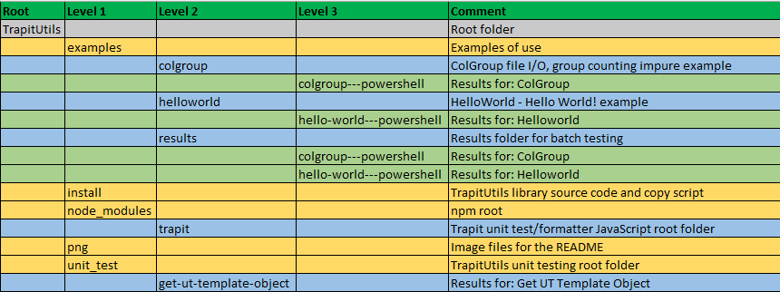

## Folder Structure

The project folder structure is shown below.

There are three subfolders below the trapit root folder:
- `examples`: Two working powershell examples are included in their own subfolders, with both test scripts and a main script that shows how the unit under test would normally be called
- `install`: This holds the project library source code and a script to copy the module to the first folder in the powershell path
- `node_modules`: npm root
- `png`: This holds the image files for the README
- `unit_test`: Root folder for unit testing of the Get-UT_TemplateObject function, with subfolder having the results files

## See Also
- [Trapit - JavaScript Unit Tester/Formatter](https://github.com/BrenPatF/trapit_nodejs_tester)
- [Unit Testing, Scenarios and Categories: The SCAN Method](https://brenpatf.github.io/jekyll/update/2021/10/17/unit-testing-scenarios-and-categories-the-scan-method.html)
- [Powershell General Utilities module](https://github.com/BrenPatF/powershell_utils/tree/master/Utils)

!## Software Versions

- Windows 11
- Powershell 7
- npm 6.13.4
- Node.js v12.16.1

!## License
MIT