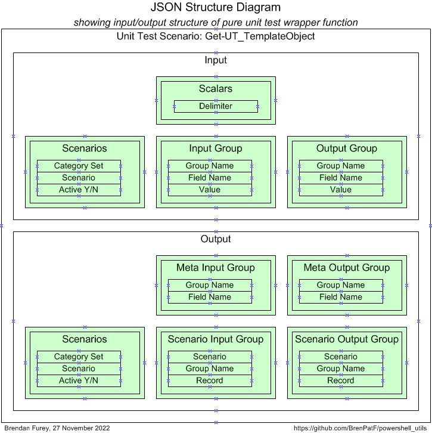
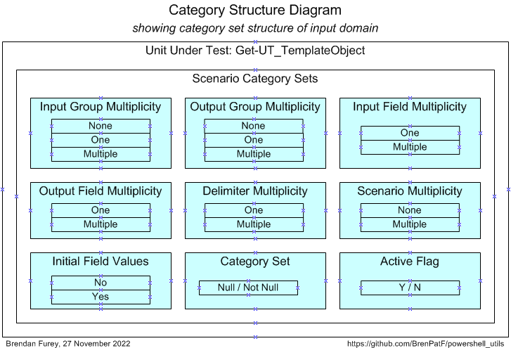

## Unit Testing

In this section the unit testing core API function Get-UT_TemplateObject is itself tested using the Math Function Unit Testing design pattern. A 'pure' wrapper function is constructed that takes input parameters and returns a value, and is tested within a loop over scenario records read from a JSON file.

### Step 1: Create JSON File

#### Unit Test Wrapper Function

The signature of the unit under test is: 

```powershell
Get-UT_TemplateObject($inpGroupLis, $outGroupLis, $delimiter, $sceLis)
```
where the parameters are described in the API section above. The diagram below shows the structure of the input and output of the wrapper function.



From the input and output groups depicted we can construct CSV files with flattened group/field structures, and default values added, as follows (with `get_ut_template_object_inp.csv` left, `get_ut_template_object_out.csv` right):


#### Scenario Category ANalysis (SCAN)

After analysis of the possible scenarios in terms of categories and category sets, we can depict them on a Category Structure diagram:



We can tabulate the results of the category analysis, and assign a scenario against each category set/category with a unique description:

|  # | Category Set              | Category      | Scenario                                       |
|---:|:--------------------------|:--------------|:-----------------------------------------------|
|  1 | Input Group Multiplicity  | None          | No input groups                                |
|  2 | Input Group Multiplicity  | One           | One input group                                |
|  3 | Input Group Multiplicity  | Multiple      | Multiple input groups                          |
|  4 | Output Group Multiplicity | None          | No output groups                               |
|  5 | Output Group Multiplicity | One           | One output group                               |
|  6 | Output Group Multiplicity | Multiple      | Multiple output groups                         |
|  7 | Input Field Multiplicity  | One           | One input field                                |
|  8 | Input Field Multiplicity  | Multiple      | Multiple input fields                          |
|  9 | Output Field Multiplicity | One           | One output field                               |
| 10 | Output Field Multiplicity | Multiple      | Multiple output fields                         |
| 11 | Delimiter Multiplicity    | One           | One-character delimiter                        |
| 12 | Delimiter Multiplicity    | Multiple      | Multi-character delimiter                      |
| 13 | Scenarios Multiplicity    | None          | Scenarios file not present                     |
| 14 | Scenarios Multiplicity    | Multiple      | Multiple scenarios                             |
| 15 | Initial Field Values      | Null          | All field values null                          |
| 16 | Initial Field Values      | Mixed         | Some field values null, some not null          |
| 17 | Category Set              | Null/Not Null | Scenarios with null and not null category sets |
| 18 | Active Flag               | Y/N           | Scenarios with Y and N active flag             |

From the scenarios identified we can construct the following CSV file (`get_ut_template_object_sce.csv`), taking the category set and scenario columns, and adding an initial value for the active flag:


The API can be run with the following powershell in the folder of the CSV files:

!###### Format-JSON-Get-UT_TemplateObject

```powershell
Import-Module TrapitUtils
Write-UT_Template 'get_ut_template_object' '|'
```
This creates the template JSON file, get_ut_template_object_temp.json, which contains an element for each of the scenarios, with the appropriate category set and active flag, with a single record in each group with default values from the groups CSV files.

### Step 2: Create Results Object

Step 2 requires the writing of a wrapper function that is passed into a call to the second API.

- `Test-Unit` is the unit test driver function from the TrapitUtils package that reads the input JSON file, calls the wrapper function for each scenario, and writes the output JSON file with the actual results merged in along with the expected results

!#### Test-GetUT_TemplateObject.ps1 (skeleton)
```powershell
Import-Module TrapitUtils
$DELIM = ';'

function getGroupObjLis($strLis) { (function body) }
function getSceObjLis($strLis) { (function body) }
function getGroupFieldStrLis($obj) { (function body) }
function purelyWrap-Unit($inpGroups) { # input scenario groups
(function body)
}
Test-Unit ($PSScriptRoot + '/get_ut_template_object.json') ($PSScriptRoot + '/get_ut_template_object_out.json') `
          ${function:purelyWrap-Unit}
```
This creates the output JSON file: get_ut_template_object_out.json. Generally it will be preferable not to call the script directly, but to include the call in a higher level script that calls it and also calls the JavaScript formatter, as in the next section.

### Step 3: Format Results

Step 3 involves formatting the results contained in the JSON output file from step 2, via the JavaScript formatter, and this step can be combined with step 2 for convenience.

- `Test-Format` is the function from the TrapitUtils package that calls the main test driver function, then passes the output JSON file name to the JavaScript formatter and outputs a summary of the results. It takes the name of the test driver script and the JavaScript root location as parameters.

!#### Run-Test-Get-UT_TemplateObject.ps1

```powershell
Import-Module TrapitUtils
Test-Format ($PSScriptRoot + '/Test-Get-UT_TemplateObject.ps1') ($PSScriptRoot + '/..')
```
This script creates a results subfolder, with results in text and HTML formats, in the script folder, and outputs the following summary:

```
Results summary for file: [MY_PATH]/TrapitUtils/unit_test/get_ut_template_object_out.json
===============================================================================================================

File:          get_ut_template_object_out.json
Title:         Get UT Template Object
Inp Groups:    4
Out Groups:    6
Tests:         18
Fails:         0
Folder:        get-ut-template-object
```

Next we show the scenario-level summary of results, and show the detail for one of the scenarios.

You can review the HTML formatted unit test results here:

- [Unit Test Report: Get UT Template Object](http://htmlpreview.github.io/?https://github.com/BrenPatF/powershell_utils/blob/master/TrapitUtils/unit_test/get-ut-template-object/get-ut-template-object.html)

#### Unit Test Report - Get UT Template Object

```
Unit Test Report: Get UT Template Object
========================================

      #    Category Set               Scenario                                        Fails (of 6)  Status 
      ---  -------------------------  ----------------------------------------------  ------------  -------
      1    Input Group Multiplicity   No input groups                                 0             SUCCESS
      2    Input Group Multiplicity   One input group                                 0             SUCCESS
      3    Input Group Multiplicity   Multiple input groups                           0             SUCCESS
      4    Output Group Multiplicity  No output groups                                0             SUCCESS
      5    Output Group Multiplicity  One output group                                0             SUCCESS
      6    Output Group Multiplicity  Multiple output groups                          0             SUCCESS
      7    Input Field Multiplicity   One input field                                 0             SUCCESS
      8    Input Field Multiplicity   Multiple input fields                           0             SUCCESS
      9    Output Field Multiplicity  One output field                                0             SUCCESS
      10   Output Field Multiplicity  Multiple output fields                          0             SUCCESS
      11   Delimiter Multiplicity     One-character delimiter                         0             SUCCESS
      12   Delimiter Multiplicity     Multi-character delimiter                       0             SUCCESS
      13   Scenarios Multiplicity     Scenarios file not present                      0             SUCCESS
      14   Scenarios Multiplicity     Multiple scenarios                              0             SUCCESS
      15   Initial Field Values       All field values null                           0             SUCCESS
      16   Initial Field Values       Some field values null, some not null           0             SUCCESS
      17   Category Set               Scenarios with null and not null category sets  0             SUCCESS
      18   Active Flag                Scenarios with Y and N active flag              0             SUCCESS

Test scenarios: 0 failed of 18: SUCCESS
=======================================
Tested: 2023-04-09 14:33:22, Formatted: 2023-04-09 14:33:22
```

#### Scenario 14: Multiple scenarios [Category Set: Scenarios Multiplicity]

```
SCENARIO 14: Multiple scenarios [Category Set: Scenarios Multiplicity] {
========================================================================
   INPUTS
   ======
      GROUP 1: Scalars {
      ==================
            #  Delimiter
            -  ---------
            1  ~        
      }
      =
      GROUP 2: Scenarios {
      ====================
            #  Category Set  Scenario      Active
            -  ------------  ------------  ------
            1  Generic       Scenario One  Y     
            2  Generic       Scenario Two  Y     
      }
      =
      GROUP 3: Input Group {
      ======================
            #  Group Name     Field Name     Value        
            -  -------------  -------------  -------------
            1  Input Group 1  Input Field 1  Input Value 1
      }
      =
      GROUP 4: Output Group {
      =======================
            #  Group Name      Field Name      Value         
            -  --------------  --------------  --------------
            1  Output Group 1  Output Field 1  Output Value 1
      }
      =
   OUTPUTS
   =======
      GROUP 1: Meta Input Group {
      ===========================
            #  Group Name     Field Name   
            -  -------------  -------------
            1  Input Group 1  Input Field 1
      } 0 failed of 1: SUCCESS
      ========================
      GROUP 2: Meta Output Group {
      ============================
            #  Group Name      Field Name    
            -  --------------  --------------
            1  Output Group 1  Output Field 1
      } 0 failed of 1: SUCCESS
      ========================
      GROUP 3: Scenarios {
      ====================
            #  Category Set  Scenario      Active
            -  ------------  ------------  ------
            1  Generic       Scenario One  Y     
            2  Generic       Scenario Two  Y     
      } 0 failed of 2: SUCCESS
      ========================
      GROUP 4: Scenario Input Group {
      ===============================
            #  Scenario      Group Name     Record       
            -  ------------  -------------  -------------
            1  Scenario One  Input Group 1  Input Value 1
            2  Scenario Two  Input Group 1  Input Value 1
      } 0 failed of 2: SUCCESS
      ========================
      GROUP 5: Scenario Output Group {
      ================================
            #  Scenario      Group Name      Record        
            -  ------------  --------------  --------------
            1  Scenario One  Output Group 1  Output Value 1
            2  Scenario Two  Output Group 1  Output Value 1
      } 0 failed of 2: SUCCESS
      ========================
      GROUP 6: Unhandled Exception: Empty as expected: SUCCESS
      ========================================================
} 0 failed of 6: SUCCESS
========================
```
