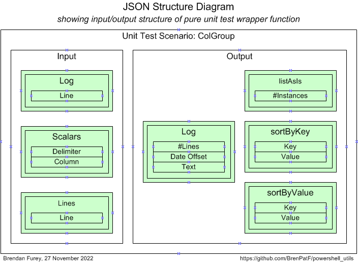
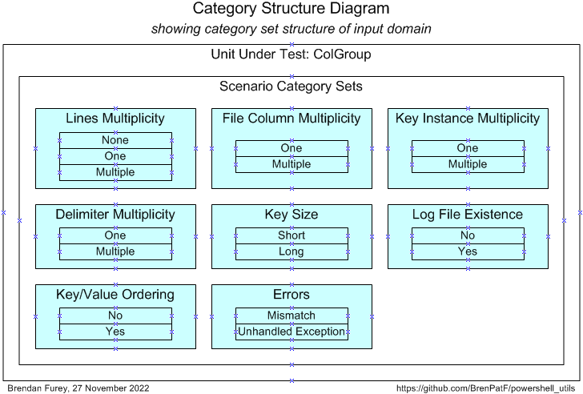

#### Example 2 - ColGroup

This example involves a class with a constructor function that reads in a CSV file and counts instances of distinct values in a given column. The constructor function appends a timestamp and call details to a log file. The class has methods to list the value/count pairs in several orderings. 

!##### ColGroup.psm1 (skeleton)
```powershell
...
Class ColGroup {
    ...
}
```

There is a main script that shows how the class might be called outside of unit testing, run from the examples folder:
!##### Show-ColGroup.ps1
```powershell
Using Module './ColGroup.psm1'
$INPUT_FILE, $DELIM, $COL = ($PSScriptRoot + '/fantasy_premier_league_player_stats.csv'), ',', 'team_name'

$grp = [ColGroup]::New($INPUT_FILE, $DELIM, $COL)

$grp.WriteList('(as is)', $grp.ListAsIs())
$grp.WriteList('key',     $grp.SortByKey())
$grp.WriteList('value',   $grp.SortByValue())
```
This can be called from a command window in the examples folder:

```powershell
$ ./colgroup/Show-ColGroup
```
with output to console:

```
Counts sorted by (as is)
========================
Team         #apps
-----------  -----
Man City      1099
Southampton   1110
Stoke City    1170
...

Counts sorted by key
====================
Team         #apps
-----------  -----
Arsenal        534
Aston Villa    685
Blackburn       33
...
Counts sorted by value
======================
Team         #apps
-----------  -----
Wolves          31
Blackburn       33
Bolton          37
...
```
and to log file, fantasy_premier_league_player_stats.csv.log:
```
2023-04-10 08:02:43: File [MY_PATH]\TrapitUtils\examples\colgroup\fantasy_premier_league_player_stats.csv, delimiter ',', column team_name
```

The example illustrates how a wrapper function can handle `impure` features of the unit under test:
- Reading input from file
- Writing output to file

...and also how the JSON input file can allow for nondeterministic outputs giving rise to deterministic test outcomes:
- By using regex matching for strings including timestamps
- By using number range matching and converting timestamps to epochal offsets (number of units of time since a fixed time)

##### Step 1: Create JSON File - ColGroup

###### Unit Test Wrapper Function - ColGroup

Here is a diagram of the input and output groups for this example:



From the input and output groups depicted we can construct CSV files with flattened group/field structures, and default values added, as follows (with `colgrp_inp.csv` left, `colgrp_out.csv` right):


###### Scenario Category ANalysis (SCAN) - ColGroup

After analysis of the possible scenarios in terms of categories and category sets, we can depict them on a Category Structure diagram:



We can tabulate the results of the category analysis, and assign a scenario against each category set/category with a unique description:

|  # | Category Set              | Category            | Scenario                                 |
|---:|:--------------------------|:--------------------|:-----------------------------------------|
|  1 | Lines Multiplicity        | None                | No lines                                 |
|  2 | Lines Multiplicity        | One                 | One line                                 |
|  3 | Lines Multiplicity        | Multiple            | Multiple lines                           |
|  4 | File Column Multiplicity  | One                 | One column in file                       |
|  5 | File Column Multiplicity  | Multiple            | Multiple columns in file                 |
|  6 | Key Instance Multiplicity | One                 | One key instance                         |
|  7 | Key Instance Multiplicity | Multiple            | Multiple key instances                   |
|  8 | Delimiter Multiplicity    | One                 | One delimiter character                  |
|  9 | Delimiter Multiplicity    | Multiple            | Multiple delimiter characters            |
| 10 | Key Size                  | Short               | Short key                                |
| 11 | Key Size                  | Long                | Long key                                 |
| 12 | Log file existence        | No                  | Log file does not exist at time of call  |
| 13 | Log file existence        | Yes                 | Log file exists at time of call          |
| 14 | Key/Value Ordering        | No                  | Order by key differs from order by value |
| 15 | Key/Value Ordering        | Yes                 | Order by key same as order by value      |
| 16 | Errors                    | Mismatch            | Actual/expected mismatch                 |
| 17 | Errors                    | Unhandled Exception | Unhandled Exception                      |

From the scenarios identified we can construct the following CSV file (`colgrp_sce.csv`), taking the category set and scenario columns, and adding an initial value for the active flag:


The API can be run with the following powershell script in the folder of the CSV files:

!###### Format-JSON-ColGroup.ps1
```powershell
Import-Module TrapitUtils
Write-UT_Template 'colgroup' '|'
```
This creates the template JSON file, colgroup_temp.json, which contains an element for each of the scenarios, with the appropriate category set and active flag, with a single record in each group with default values from the groups CSV files. Here is the "Multiple lines" element:

    "Multiple lines": {
      "active_yn": "N",
      "category_set": "Lines Multiplicity",
      "inp": {
        "Log": [
          ""
        ],
        "Scalars": [
          ",|col_1"
        ],
        "Lines": [
          "col_0,col_1,col_2"
        ]
      },
      "out": {
        "Log": [
          "1|IN [0,2000]|LIKE /.*: File .*ut_group.*.csv, delimiter ',', column 0/"
        ],
        "listAsIs": [
          "1"
        ],
        "sortByKey": [
          "val_1|1"
        ],
        "sortByValue": [
          "val_1|1"
        ]
      }
    },

For each scenario element, we need to update the values to reflect the scenario to be tested, in the actual input JSON file, colgroup.json. In the case above, we can just replace the "Lines" input group with:

        "Lines": [
          "col_0,col_1,col_2",
          "val_0,val_1,val_2",
          "val_0,val_1,val_2"
        ]

and replace '1' with '2' in two of the output groups:

        "sortByKey": [
          "val_1|2"
        ],
        "sortByValue": [
          "val_1|2"
        ]

##### Step 2: Create Results Object - ColGroup

Step 2 requires the writing of a wrapper function that is passed into a call to the second API.

- `Test-Unit` is the unit test driver function from the TrapitUtils package that reads the input JSON file, calls the wrapper function for each scenario, and writes the output JSON file with the actual results merged in along with the expected results

It takes the names of the input and output JSON files, plus the wrapper function name, as parameters.

!###### Test-ColGroup.ps1 (skeleton)
```powershell
Using Module './ColGroup.psm1'
Import-Module TrapitUtils
function purelyWrap-Unit($inpGroups) { # input scenario groups
(function body)
}
Test-Unit ($PSScriptRoot + '/colgroup.json') ($PSScriptRoot + '/colgroup_out.json') `
          ${function:purelyWrap-Unit}
```
This creates the output JSON file: colgroup_out.json. Generally it will be preferable not to call the script directly, but to include the call in a higher level script that calls it and also calls the JavaScript formatter, as in the next section.

##### Step 3: Format Results - ColGroup

Step 3 involves formatting the results contained in the JSON output file from step 2, via the JavaScript formatter, and this step can be combined with step 2 for convenience.

- `Test-Format` is the function from the TrapitUtils package that calls the main test driver function, then passes the output JSON file name to the JavaScript formatter and outputs a summary of the results. 

It takes the name of the test driver script and the JavaScript root location as parameters.

!###### Run-Test-ColGroup.ps1
```powershell
Import-Module TrapitUtils
Test-Format ($PSScriptRoot + '/Test-ColGroup.ps1') ($PSScriptRoot + '/../..')
```
This script creates a results subfolder, with results in text and HTML formats, in the script folder, and outputs the following summary:

```
Results summary for file: [MY_PATH]/powershell_utils/TrapitUtils/examples/colgroup/colgroup_out.json
=========================================================================================================

File:          colgroup_out.json
Title:         ColGroup - Powershell
Inp Groups:    3
Out Groups:    5
Tests:         17
Fails:         3
Folder:        colgroup---powershell
```

Here we show the scenario-level summary of results for the specific example, and show the detail for one of the failing scenarios.

You can review the HTML formatted unit test results here:

- [Unit Test Report: ColGroup](http://htmlpreview.github.io/?https://github.com/BrenPatF/powershell_utils/blob/master/TrapitUtils/examples/colgroup/colgroup---powershell/colgroup---powershell.html)

###### Unit Test Report - ColGroup

```
Unit Test Report: ColGroup - Powershell
=======================================

      #    Category Set               Scenario                                  Fails (of 5)  Status 
      ---  -------------------------  ----------------------------------------  ------------  -------
      1    Lines Multiplicity         No lines                                  0             SUCCESS
      2    Lines Multiplicity         One line                                  0             SUCCESS
      3    Lines Multiplicity         Multiple lines                            0             SUCCESS
      4    File Column Multiplicity   One column in file                        0             SUCCESS
      5    File Column Multiplicity   Multiple columns in file                  0             SUCCESS
      6    Key Instance Multiplicity  One key instance                          0             SUCCESS
      7    Key Instance Multiplicity  Multiple key instances                    0             SUCCESS
      8    Delimiter Multiplicity     One delimiter character                   0             SUCCESS
      9*   Delimiter Multiplicity     Multiple delimiter characters             5             FAILURE
      10   Key Size                   Short key                                 0             SUCCESS
      11   Key Size                   Long key                                  0             SUCCESS
      12   Log file existence         Log file does not exist at time of call   0             SUCCESS
      13   Log file existence         Log file exists at time of call           0             SUCCESS
      14   Key/Value Ordering         Order by key differs from order by value  0             SUCCESS
      15   Key/Value Ordering         Order by key same as order by value       0             SUCCESS
      16*  Errors                     Actual/expected mismatch                  2             FAILURE
      17*  Errors                     Unhandled exception                       5             FAILURE

Test scenarios: 3 failed of 17: FAILURE
=======================================
Tested: 2023-04-09 14:42:06, Formatted: 2023-04-09 14:42:06
```

###### Scenario 9: Multiple delimiter characters

This is one of three scenarios that fail, and it fails due to an unhandled exception, which is captured by the Test-Unit API. The error message is printed in a special output group, `Unhandled Exception` that is not specified in the input JSON file but added dynamically by the API into each scenario. In the case of an unhandled exception all the other output groups have empty 'actual' record sets, which will usually be recorded as failing. Note that we also use the scenario data to explicitly demonstrate behaviour of unhandled exceptions against the 'Errors' category set in scenario 17.

The error message comes from powershell itself and explains clearly what has gone wrong:
```
Cannot bind parameter 'Delimiter'. Cannot convert value ";;" to type "System.Char". Error: "String must be exactly one character long."

```
The code uses a standard powershell API, Import-CSV, to read in a CSV file, which takes the delimiter as a parameter. This API does not accept multi-character delimiters as the message indicates.

```
SCENARIO 9: Multiple delimiter characters [Category Set: Delimiter Multiplicity] {
==================================================================================
   INPUTS
   ======
      GROUP 1: Log {
      ==============
            #  Line
            -  ----
            1      
      }
      =
      GROUP 2: Scalars {
      ==================
            #  Delimiter  Column
            -  ---------  ------
            1  ;;         col_1 
      }
      =
      GROUP 3: Lines {
      ================
            #  Line               
            -  -------------------
            1  col_0;;col_1;;col_2
            2  val_0;;val_1;;val_2
      }
      =
   OUTPUTS
   =======
      GROUP 1: Log {
      ==============
            #   #Lines       Date Offset        Text                                                             
            --  -----------  -----------------  -----------------------------------------------------------------
            1   1            IN [0,2000]:       LIKE /.*: File .*ut_group.csv, delimiter ',', column col_1/:     
            1*  *NO RECORD*  NOT IN [0,2000]:   NOT LIKE /.*: File .*ut_group.csv, delimiter ',', column col_1/: 
      } 1 failed of 1: FAILURE
      ========================
      GROUP 2: listAsIs {
      ===================
            #   #Instances 
            --  -----------
            1   1          
            1*  *NO RECORD*
      } 1 failed of 1: FAILURE
      ========================
      GROUP 3: sortByKey {
      ====================
            #   Key          Value
            --  -----------  -----
            1   val_1        1    
            1*  *NO RECORD*       
      } 1 failed of 1: FAILURE
      ========================
      GROUP 4: sortByValue {
      ======================
            #   Key          Value
            --  -----------  -----
            1   val_1        1    
            1*  *NO RECORD*       
      } 1 failed of 1: FAILURE
      ========================
      GROUP 5: Unhandled Exception {
      ==============================
            #   Error Message                                                                                                                          
            --  ---------------------------------------------------------------------------------------------------------------------------------------
            1   *NO RECORD*                                                                                                                            
            1*  Cannot bind parameter 'Delimiter'. Cannot convert value ";;" to type "System.Char". Error: "String must be exactly one character long."
      } 1 failed of 1: FAILURE
      ========================
} 5 failed of 5: FAILURE
========================
```

#### Batch Testing

We can test and format the results for both examples at once via another API:

- `Test-FormatFolder` is the function from the TrapitUtils package that calls each of a list of powershell unit test driver scripts, then calls the JavaScript formatter, which writes the formatted results files to a subfolder within a results folder, based on the titles, returning a summary of the results

It takes as parameters: an array of full names of the unit test driver scripts; the folder where JSON files are copied, and results subfolders placed; the parent folder of the JavaScript node_modules npm root folder.

!##### Run-Test-Examples.ps1
```powershell
Import-Module TrapitUtils
$psScriptLis = @(($PSScriptRoot + '/colgroup/Test-ColGroup.ps1'), `
                 ($PSScriptRoot + '/helloworld/Test-HelloWorld.ps1'))
$jsonFolder  = $PSScriptRoot + '/results'
$npmRoot     = $PSScriptRoot + '/..'
Test-FormatFolder $psScriptLis $jsonFolder $npmRoot
```
This script creates results subfolders within the JSON files folder for each unit, and outputs a summary of the results:

```
Unit Test Results Summary for Folder [MY_PATH]/powershell_utils/TrapitUtils/examples/results
==================================================================================================================
 File                 Title                     Inp Groups  Out Groups  Tests  Fails  Folder                  
--------------------  ------------------------  ----------  ----------  -----  -----  ------------------------
*colgroup_out.json    ColGroup - Powershell              3           5     17      3  colgroup---powershell   
 helloworld_out.json  Hello World - Powershell           0           2      1      0  hello-world---powershell

1 externals failed, see [MY_PATH]/powershell_utils/TrapitUtils/examples/results for scenario listings
colgroup_out.json
```

There is also a script Run-Main-Examples.ps1 in the examples folder that runs both examples directly.