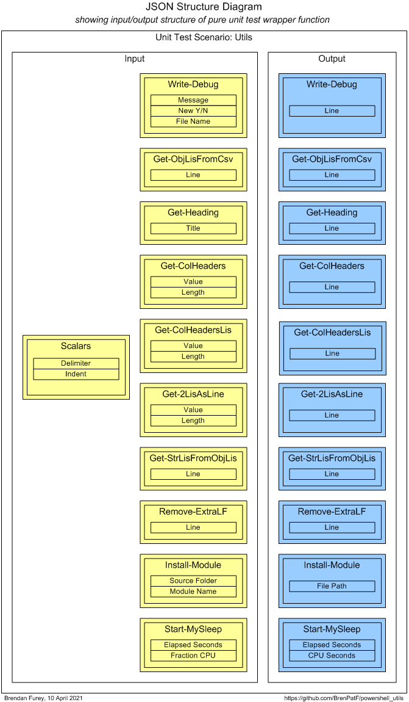
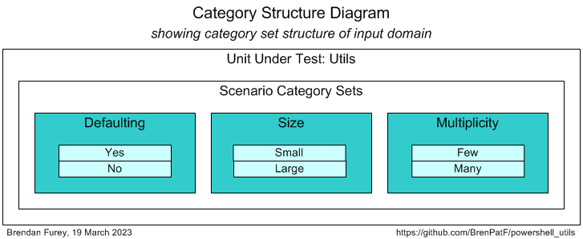
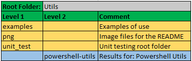

# powershell_utils/Utils


> Powershell General Utilities module

:hammer_and_wrench:

This module comprises a set of generic functions for 'pretty-printing' etc.

Usage is demonstrated by examples including a simple file-reading and group-counting class module.

The module is tested using [The Math Function Unit Testing Design Pattern](https://brenpatf.github.io/2023/06/05/the-math-function-unit-testing-design-pattern.html), with test results in HTML and text format included.

# In this README...
[&darr; Usage](#usage)<br />
[&darr; API](#api)<br />
[&darr; Installation](#installation)<br />
[&darr; Unit Testing](#unit-testing)<br />
[&darr; Folder Structure](#folder-structure)<br />
[&darr; See Also](#see-also)<br />
## Usage
[&uarr; In this README...](#in-this-readme)<br />
[&darr; Show-Examples.ps1 (extract)](#show-examplesps1-extract)<br />
[&darr; ColGroup.psm1 (extracts)](#colgrouppsm1-extracts)<br />

There is a script with examples of use of all the utilities, some used directly and some via a demo class ColGroup. We show first an extract from the script, including use of a debugging utility and the calls to the demo class.

Secondly, we show extracts from the demo class, with the utlity calls it makes, and the 'pretty-printed' output from one of its methods.

The full scripts and output logs can be found in the `examples` folder.

### Show-Examples.ps1 (extract)
[&uarr; Usage](#usage)<br />

```powershell
Using Module './ColGroup.psm1'
Import-Module Utils
$INPUT_FILE, $DELIM, $COL = ($PSScriptRoot + './fantasy_premier_league_player_stats.csv'), ',', 'team_name'

Get-Heading 'Demonstrate initial call to Write-Debug...'
Write-Debug 'Debug' $true

Get-Heading 'ColGroup constructor uses Get-ObjLisFromCsv...'
$grp = [ColGroup]::New($INPUT_FILE, $DELIM, $COL)

$meas = $grp.ListAsIs() | measure-object -property value -sum
Get-Heading 'Demonstrate subsequent call to Write-Debug...'
Write-Debug ('Counted ' + $meas.count + ' teams, with ' + $meas.sum + ' appearances')

Get-Heading 'ColGroup.WriteList uses the pretty-printing functions...'
$grp.WriteList('(as is)', $grp.ListAsIs())
...
```

The extract above from the script demonstrates usage of:

- Write-Debug
- Get-Heading

The debug file would then have lines such as the following:

```
Debug starting, 04/09/2023 15:44:33: Debug
Counted 23 teams, with 22831 appearances
```
The full script also demonstrates usage of:

- Get-StrLisFromObjLis
- Remove-ExtraLF
- Install-Module
- Get-ColHeadersLis
- Start-MySleep

### ColGroup.psm1 (extracts)
[&uarr; Usage](#usage)<br />

The constructor function reads a csv file into a list of objects, and demonstrates the usage of:

- Get-ObjLisFromCsv

```powershell
    $objLis = Get-ObjLisFromCsv $file $delim
```

The method WriteList demonstrates the usage of:

- Get-Heading
- Get-ColHeaders
- Get-2LisAsLine

```powershell
    [String[]]WriteList($sortBy,                # sort by descriptor
                        [Object[]]$keyValues) { # list of key/value objects

        $strLis = Get-Heading ('Counts sorted by ' + $sortBy)
        $strLis += Get-ColHeaders @(@('Team', -$this.maxLen), @('#apps', 5))
        foreach ($kv in $keyValues) {
            $strLis += Get-2LisAsLine @(@($kv.name, -$this.maxLen), @($kv.value, 5))
        }
        return $strLis
    }
```
The method returns a list of strings, which the script then outputs such as the following (first call):

```
Counts sorted by (as is)
========================
Team         #apps
-----------  -----
Bolton          37
Southampton   1110
QPR           1517
...
```
To run the examples script, open a powershell window in the examples folder and execute as follows:

```
$ ./Show-Examples
```
## API
[&uarr; In this README...](#in-this-readme)<br />
[&darr; Write-Debug](#write-debug)<br />
[&darr; Get-ObjLisFromCsv](#get-objlisfromcsv)<br />
[&darr; Get-Heading](#get-heading)<br />
[&darr; Get-ColHeaders](#get-colheaders)<br />
[&darr; Get-ColHeadersLis](#get-colheaderslis)<br />
[&darr; Get-2LisAsLine](#get-2lisasline)<br />
[&darr; Get-StrLisFromObjLis](#get-strlisfromobjlis)<br />
[&darr; Remove-ExtraLF](#remove-extralf)<br />
[&darr; Install-Module](#install-module)<br />
[&darr; Start-MySleep](#start-mysleep)<br />

```powershell
Import-Module Utils
```

### Write-Debug
[&uarr; API](#api)<br />
```powershell
Write-Debug($msg, $new, $filename)
```
Writes a line of text to a debug file, with parameters:

* `[string]$msg`: timer name
* `[string]$new`: overwrite file if $true; default $false
* `[string]$filename`: file name; default '.\debug.log'

Return value:

* `[void]`

### Get-ObjLisFromCsv
[&uarr; API](#api)<br />
```powershell
Get-ObjLisFromCsv($csv, $delimiter)
```
Imports a csv file with headers into an array of objects; keys are the column headers, with cells as values, with parameters:

* `[string]$csv`: csv file
* `[string]$delimiter`: delimiter; default ','

Return value:

* `[object[]]`: array of objects with fields named after the column headers:
	* `[string]column header 1`: value in column 1
	* ...

### Get-Heading
[&uarr; API](#api)<br />
```powershell
Get-Heading($title, $indent)
```
Returns a 2-line heading with double underlining, from an input string, with parameters:

* `[string]$title`: title
* `[int]$indent`: indent level; default 0

Return value:

* `[object[]]`: array of objects with fields named after the column headers:

### Get-ColHeaders
[&uarr; API](#api)<br />
```powershell
Get-ColHeaders($header2Lis, $indent)
```
Returns a list of strings as one line, input as list of (string, length) tuples, and indent spaces, with parameters:

* `$header2Lis`: list of (string, length) tuples; -ve length -> right-justify
* `[int]$indent`: indent level; default 0

Return value:

* `[string]`: column headers 2-line string with headers underlined

### Get-ColHeadersLis
[&uarr; API](#api)<br />
```powershell
Get-ColHeaders($header2Lis, $indent)
```
Returns a list of strings as one line, input as list of (string, length) tuples, and indent spaces, with parameters:

* `$header2Lis`: list of (string, length) tuples; -ve length -> right-justify
* `[int]$indent`: indent level; default 0

Return value:

* `[string[]]`: column headers 2-element array of strings with headers underlined

### Get-2LisAsLine
[&uarr; API](#api)<br />
```powershell
Get-2LisAsLine($line2Lis, $indent)
```
Returns a list of strings as one line, input as list of (string, length) tuples, and indent spaces, with parameters:

* `$line2Lis`: list of (string, length) tuples; -ve length -> right-justify
* `[int]$indent`: indent level; default 0

Return value:

* `[string]`: formatted line

### Get-StrLisFromObjLis
[&uarr; API](#api)<br />
```powershell
Get-StrLisFromObjLis($objLis, $delimiter)
```
Returns a list of delimited value strings from a list of objects, with simple string properties; uses the first object to start return list with the object names delimited, with parameters:

* `[Object[]]$objLis`: list of objects
* `[string]$delimiter`: $delimiter; default '|'

Return value:

* `[void]`

### Remove-ExtraLF
[&uarr; API](#api)<br />
```powershell
Remove-ExtraLF($fileName)
```
Removes the last two characters from a file, intended for the spurious extra line added by powershell functions like Out-File in Windows, with parameters:

* `[string]$fileName`: file name

Return value:

* `[void]`

### Install-Module
[&uarr; API](#api)<br />
```powershell
Install-Module($srcFolder, $modName)
```
Installs a module in the first folder in PSModulePath environment variable, with parameters:

* `[string]$srcFolder`: source folder for the module file
* `[string]$modName`: module name (stem, without '.psm1' extension)

Return value:

* `[void]`

### Start-MySleep
[&uarr; API](#api)<br />
```powershell
Start-MySleep($stime, $fractionCPU)
```
Sleep for $stime seconds, of which target $fractionCPU as fraction of total to be CPU, with parameters:

* `[float]$stime`: total seconds to sleep for
* `[float]$fractionCPU`: fraction of total to be CPU; default 0.5

Return value:

* `[void]`

## Installation
[&uarr; In this README...](#in-this-readme)<br />

To install Utils open a powershell window in the root Utils folder, and execute as follows:
```
$ ./Install-Utils
```
This will create a folder Utils under the first folder in your `PSModulePath` environment variable, and copy Utils.psm1 to it.
## Unit Testing
[&uarr; In this README...](#in-this-readme)<br />
[&darr; Unit Testing Prerequisites](#unit-testing-prerequisites)<br />
[&darr; Unit Testing Process](#unit-testing-process)<br />
[&darr; Unit Test Results](#unit-test-results)<br />

### Unit Testing Prerequisites
[&uarr; Unit Testing](#unit-testing)<br />

The powershell package TrapitUtils is required to run the unit tests. This is a subproject of the same GitHub project as Utils, so if you have downloaded it, you will already have it. The module is referenced using a relative path, so that it does not need to be installed explicitly.

The powershell package includes an npm package to format the unit test output JSON file in HTML and/or text, but you need to have [Node.js](https://nodejs.org/en/download) installed to run it.

### Unit Testing Process
[&uarr; Unit Testing](#unit-testing)<br />
[&darr; Step 1: Create Input Scenarios File](#step-1-create-input-scenarios-file)<br />
[&darr; Step 2: Create Results Object](#step-2-create-results-object)<br />
[&darr; Step 3: Format Results](#step-3-format-results)<br />
[&darr; Unit Test Driver Script](#unit-test-driver-script)<br />

The package is tested using [The Math Function Unit Testing Design Pattern](https://brenpatf.github.io/2023/06/05/the-math-function-unit-testing-design-pattern.html). In this approach, a 'pure' wrapper function is constructed that takes input parameters and returns a value, and is tested within a loop over scenario records read from a JSON file.

In this case, where we have a set of small independent methods, most of which are pure functions, the wrapper function is designed to test all of them in a single generalised transaction.

At a high level the Math Function Unit Testing design pattern involves three main steps:

1. Create an input file containing all test scenarios with input data and expected output data for each scenario
2. Create a results object based on the input file, but with actual outputs merged in, based on calls to the unit under test
3. Use the results object to generate unit test results files formatted in HTML and/or text


The first and third of these steps are supported by generic utilities that can be used in unit testing in any language. The second step uses a language-specific unit test driver utility.

#### Step 1: Create Input Scenarios File
[&uarr; Unit Testing Process](#unit-testing-process)<br />
[&darr; Unit Test Wrapper Function](#unit-test-wrapper-function)<br />
[&darr; Scenario Category ANalysis (SCAN)](#scenario-category-analysis-scan)<br />

##### Unit Test Wrapper Function
[&uarr; Step 1: Create Input Scenarios File](#step-1-create-input-scenarios-file)<br />

The diagram below shows the structure of the input and output of the wrapper function.



From the input and output groups depicted we can construct CSV files with flattened group/field structures, and default values added, as follows (with `ps_utils_inp.csv` left, `ps_utils_out.csv` right):


##### Scenario Category ANalysis (SCAN)
[&uarr; Step 1: Create Input Scenarios File](#step-1-create-input-scenarios-file)<br />
[&darr; Generic Category Sets](#generic-category-sets)<br />
[&darr; Categories and Scenarios](#categories-and-scenarios)<br />

The art of unit testing lies in choosing a set of scenarios that will produce a high degree of confidence in the functioning of the unit under test across the often very large range of possible inputs.

A useful approach to this can be to think in terms of categories of inputs, where we reduce large ranges to representative categories.  I explore this approach further in this article:

- [Unit Testing, Scenarios and Categories: The SCAN Method](https://brenpatf.github.io/2021/10/17/unit-testing-scenarios-and-categories-the-scan-method.html)

While the examples in the blog post aimed at minimal sets of scenarios, we have since found it simpler and clearer to use a separate scenario for each category.

###### Generic Category Sets
[&uarr; Scenario Category ANalysis (SCAN)](#scenario-category-analysis-scan)<br />

As explained in the article mentioned above, it can be very useful to think in terms of generic category sets that apply in many situations. In this case, where we are testing a set of independent utilities, they are particularly useful and can be applied across many of the utilities at the same time.

###### *Binary*

There are many situations where a category set splits into two opposing values such as Yes / No or True / False. In this case we can use it to apply to whether defaults are used or override parameters are passed.

| Code | Description     |
|:----:|:----------------|
| Yes  | Yes / True etc. |
| No   | No / False etc. |

###### *Size*

We may wish to check that functions work correctly for both large and small parameter or other data values.

| Code   | Description  |
|:------:|:-------------|
| Small  | Small values |
| Large  | Large values |

###### *Multiplicity*

The generic category set of multiplicity is applicable very frequently, and we should check each of the relevant categories. In some cases we'll want to check None / One / Multiple instance categories, but in this case we'll use Few / Many.

| Code     | Description     |
|:--------:|:----------------|
| Few      | Few values      |
| Many     | Many values     |

###### Categories and Scenarios
[&uarr; Scenario Category ANalysis (SCAN)](#scenario-category-analysis-scan)<br />

After analysis of the possible scenarios in terms of categories and category sets, we can depict them on a Category Structure diagram:



We can tabulate the results of the category analysis, and assign a scenario against each category set/category with a unique description:

|  # | Category Set | Category      | Scenario      |
|---:|:-------------|:--------------|:--------------|
|  1 | Defaulting   | Yes           | Defaulted     |
|  2 | Defaulting   | No            | Not Defaulted |
|  3 | Size         | Small         | Small         |
|  4 | Size         | Large         | Large         |
|  5 | Multiplicity | Few           | Few           |
|  6 | Multiplicity | Many          | Many          |

From the scenarios identified we can construct the following CSV file (`ps_utils_sce.csv`), taking the category set and scenario columns, and adding an initial value for the active flag:


The API can be run with the following powershell in the folder of the CSV files:

###### *Format-JSON-Utils.ps1*
```powershell
Import-Module ..\..\TrapitUtils\TrapitUtils.psm1
Write-UT_Template 'ps_utils' '|'
```
This creates the template JSON file, ps_utils_temp.json, which contains an element for each of the scenarios, with the appropriate category set and active flag, with a single record in each group with default values from the groups CSV files. The template file is then updated manually with data appropriate to each scenario.

#### Step 2: Create Results Object
[&uarr; Unit Testing Process](#unit-testing-process)<br />

Step 2 requires the writing of a wrapper function that is passed into a unit test library function, Test-Unit, via the entry point API,  `Test-Format`. Test-Unit reads the input JSON file, calls the wrapper function for each scenario, and writes the output JSON file with the actual results merged in along with the expected results.

##### purelyWrap-Unit (skeleton)
This is a skeleton listing of the wrapper function, which is included in the script Test-Utils.ps1 and passed as a parameter to Test-Format.

```powershell
function purelyWrap-Unit($inpGroups) { # input scenario groups
    function getWriteDebug($inpRecLis)                   { (function body) }
    function getObjLisFromCsv($inpRecLis, $delimiter)    { (function body) }
    function getHeading($inpRecLis, $indent)             { (function body) }
    function getColHeaders($inpRecLis, $indent)          { (function body) }
    function getColHeadersLis($inpRecLis, $indent)       { (function body) }
    function get2LisAsLine($inpRecLis, $indent)          { (function body) }
    function getStrLisFromObjLis($inpRecLis, $delimiter) { (function body) }
    function removeExtraLF($inpRecLis)                   { (function body) }
    function installModule($inpRecLis)                   { (function body) }
    function startMySleep($inpRecLis)                    { (function body) }
    $delimiter, $indent =  $inpGroups.'Scalars'.Split(';')
    #      Object key (group name)  Private function     Group value = list of input records  Function parameters
    [PSCustomObject]@{
          'Write-Debug'           = getWriteDebug        $inpGroups.'Write-Debug'
          'Get-ObjLisFromCsv'     = getObjLisFromCsv     $inpGroups.'Get-ObjLisFromCsv'       $delimiter
          'Get-Heading'           = getHeading           $inpGroups.'Get-Heading'             $indent
          'Get-ColHeaders'        = getColHeaders        $inpGroups.'Get-ColHeaders'          $indent
          'Get-ColHeadersLis'     = getColHeadersLis     $inpGroups.'Get-ColHeadersLis'       $indent
          'Get-2LisAsLine'        = get2LisAsLine        $inpGroups.'Get-2LisAsLine'          $indent
          'Get-StrLisFromObjLis'  = getStrLisFromObjLis  $inpGroups.'Get-StrLisFromObjLis'    $delimiter
          'Remove-ExtraLF'        = removeExtraLF        $inpGroups.'Remove-ExtraLF'
          'Install-Module'        = installModule        $inpGroups.'Install-Module'
          'Start-MySleep'         = startMySleep         $inpGroups.'Start-MySleep'
    }
}
```

#### Step 3: Format Results
[&uarr; Unit Testing Process](#unit-testing-process)<br />

Step 3 involves formatting the results contained in the JSON output file from step 2, via the JavaScript formatter:

```powershell
    node ($npmRoot + '/node_modules/trapit/externals/format-external-file') $jsonFile
```

This step is executed within the TrapitUtils entry point API, `Test-Format`.

#### Unit Test Driver Script
[&uarr; Unit Testing Process](#unit-testing-process)<br />

Unit testing is executed through a driver script, Test-Utils.ps1, that contains the wrapper function and makes a call to the TrapitUtils library function `Test-Format`. This calls Test-Unit to create the output JSON file, and then calls the Javascript formatter, which writes the formatted results files to a subfolder in the script folder, with name based on the title, returning a summary of the results.

`Test-Format` has parameters:

* `[string]$utRoot`: unit test root folder
* `[string]$npmRoot`: parent folder of the JavaScript node_modules npm root folder
* `[string]$stemInpJSON`: input JSON file name stem
* `[ScriptBlock]$purelyWrapUnit`: function to process unit test for a single scenario

Return value:

* `[string]`: summary of results

###### Test-Utils.ps1 (skeleton)

```powershell
Import-Module ..\..\Utils\Utils.psm1, ..\..\TrapitUtils\TrapitUtils.psm1
function purelyWrap-Unit($inpGroups) { # input scenario groups
    ...
}
Test-Format $PSScriptRoot ($PSScriptRoot + '/../../TrapitUtils') 'ps_utils' ${function:purelyWrap-Unit}
```
This script creates a results subfolder, with results in text and HTML formats, in the script folder, and outputs the following summary:

```
Results summary for file: [MY_PATH]/powershell_utils/Utils/unit_test/ps_utils_out.json
============================================================================================================

File:          ps_utils_out.json
Title:         Powershell Utils
Inp Groups:    11
Out Groups:    11
Tests:         6
Fails:         0
Folder:        powershell-utils
```

### Unit Test Results
[&uarr; Unit Testing](#unit-testing)<br />
[&darr; Unit Test Report - Powershell Utils](#unit-test-report---powershell-utils)<br />
[&darr; Scenario 1: Defaulted [Category Set: Defaulting]](#scenario-1-defaulted-category-set-defaulting)<br />

Here we show screenshots of the scenario-level summary of results, and the results page for scenario 1.

You can review the full HTML formatted unit test results here:

- [Unit Test Report: Powershell Utils](http://htmlpreview.github.io/?https://github.com/BrenPatF/powershell_utils/blob/master/Utils/unit_test/powershell-utils/powershell-utils.html)

#### Unit Test Report - Powershell Utils
[&uarr; Unit Test Results](#unit-test-results)<br />

Here is the results summary in HTML format:


#### Scenario 1: Defaulted [Category Set: Defaulting]
[&uarr; Unit Test Results](#unit-test-results)<br />
[&darr; Scenario 1: Inputs](#scenario-1-inputs)<br />
[&darr; Scenario 1: Outputs](#scenario-1-outputs)<br />

Each scenario has its results displayed on a single page, which has been split into two screenshots here for the first one.

###### Scenario 1: Inputs
[&uarr; Scenario 1: Defaulted [Category Set: Defaulting]](#scenario-1-defaulted-category-set-defaulting)<br />


###### Scenario 1: Outputs
[&uarr; Scenario 1: Defaulted [Category Set: Defaulting]](#scenario-1-defaulted-category-set-defaulting)<br />


## Folder Structure
[&uarr; In this README...](#in-this-readme)<br />

The project folder structure is shown below.



There are three subfolders below the trapit root folder, which has README and module:
- `examples`: Examples of use
- `png`: This holds the image files for the README
- `unit_test`: Root folder for unit testing of the package, with subfolder having the results files

## See Also
[&uarr; In this README...](#in-this-readme)<br />
- [The Math Function Unit Testing Design Pattern](https://brenpatf.github.io/2023/06/05/the-math-function-unit-testing-design-pattern.html)
- [Trapit - JavaScript Unit Tester/Formatter](https://github.com/BrenPatF/trapit_nodejs_tester)
- [Unit Testing, Scenarios and Categories: The SCAN Method](https://brenpatf.github.io/2021/10/17/unit-testing-scenarios-and-categories-the-scan-method.html)
- [Powershell Trapit Unit Testing Utilities Module](https://github.com/BrenPatF/powershell_utils/tree/master/TrapitUtils)
- [Node.js Downloads](https://nodejs.org/en/download)
- [Powershell General Utilities Module](https://github.com/BrenPatF/powershell_utils/tree/master/Utils)

## Software Versions

- Windows 11
- Powershell 7
- npm 6.13.4
- Node.js v12.16.1

## License
MIT
