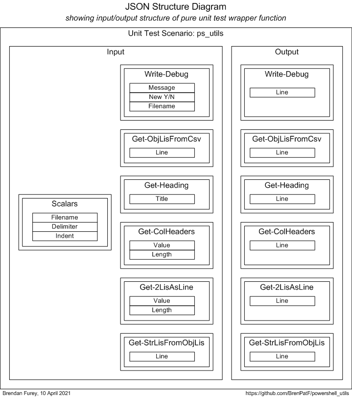

# powershell_utils/Utils
Powershell general utilities module.

:hammer_and_wrench:

This module comprises a set of generic powershell functions for 'pretty-printing' etc.

Its use is demonstrated by examples including a simple file-reading and group-counting class module.

It is unit tested using the Math Function Unit Testing design pattern, described here in general: [The Math Function Unit Testing design pattern, implemented in nodejs](https://github.com/BrenPatF/trapit_nodejs_tester#trapit)

- Recording: powershell_utils.Utils.mp4

## In this README...
[&darr; Usage](#usage)<br />
[&darr; API - Utils](#api---utils)<br />
[&darr; Installation](#installation)<br />
[&darr; Unit Testing](#unit-testing)<br />
[&darr; Operating System](#operating-system)

## Usage
[&uarr; In this README...](#in-this-readme)<br />
[&darr; Show-Examples.ps1](#show-examplesps1)<br />
[&darr; ColGroup.psm1](#colgrouppsm1)

### Show-Examples.ps1
[&uarr; Usage](#usage)

```powershell
Using Module './ColGroup.psm1'
Import-Module Utils
$INPUT_FILE, $DELIM, $COL = './fantasy_premier_league_player_stats.csv', ',', 'team_name'

# Demonstrate initial call to Write-Debug...
Write-Debug 'Debug' $true

$grp = [ColGroup]::New($INPUT_FILE, $DELIM, $COL)

$meas = $grp.ListAsIs() | measure-object -property value -sum

# Demonstrate subsequent call to Write-Debug...
Write-Debug ('Counted ' + $meas.count + ' teams, with ' + $meas.sum + ' appearances')

$grp.WriteList('(as is)', $grp.ListAsIs())
$grp.WriteList('key',     $grp.SortByKey())
$grp.WriteList('value',   $grp.SortByValue())

Get-Heading 'Demonstrate call to Get-StrLisFromObjLis...'

$exampleObj1 = [PSCustomObject]@{key11 = 'a'; key12 = 'b'} # keys from first object are included as first record
$exampleObj2 = [PSCustomObject]@{key21 = 'c'; key22 = 'd'} # keys from subsequent objects are not included

Get-StrLisFromObjLis @($exampleObj1, $exampleObj2)
```
This script demonstrates usage of:

- Write-Debug
- Get-Heading
- Get-StrLisFromObjLis

The debug file would then have lines such as the following:
```
Debug starting, 04/05/2021 14:56:30: Debug
Counted 23 teams, with 22831 appearances
```
The output file (or screen) would then have lines such as the following (after the output produced by the method shown in the next section):
```
Demonstrate call to Get-StrLisFromObjLis...
===========================================

key11|key12
a|b
c|d
```

### ColGroup.psm1
[&uarr; Usage](#usage)

The constructor function reads a csv file into a list of objects, and demonstrates the usage of:

- Get-ObjLisFromCsv

```powershell
    $objLis = Get-ObjLisFromCsv $file $delim
```
The method WriteList demonstrates the usage of:

- Get-Heading
- Get-ColHeaders
- Get-2LisAsLine

```powershell
    [String[]]WriteList($sortBy,                # sort by descriptor
                        [Object[]]$keyValues) { # list of key/value objects

        $strLis = Get-Heading ('Counts sorted by ' + $sortBy)
        $strLis += Get-ColHeaders @(@('Team', -$this.maxLen), @('#apps', 5))
        foreach ($kv in $keyValues) {

            $strLis += Get-2LisAsLine @(@($kv.name, -$this.maxLen), @($kv.value, 5))

        }
        return $strLis
    }
```
The method returns a list of strings, which the script then outputs such as the following (first call):
```
Counts sorted by (as is)
========================
Team         #apps
-----------  -----
Bolton          37
Southampton   1110
QPR           1517
Aston Villa    685
Sunderland    1162
Arsenal        534
Norwich       1229
Liverpool     1227
West Brom     1219
Newcastle     1247
Wigan         1036
West Ham      1126
Stoke City    1170
Swansea       1180
Tottenham     1288
Chelsea       1147
Everton       1147
Blackburn       33
Reading       1167
Man City      1099
Man Utd       1231
Wolves          31
Fulham        1209
```
To run the examples script, open a powershell window in the examples folder and execute as follows:

```
$ .\Show-Examples
```

## API - Utils
[&uarr; In this README...](#in-this-readme)<br />
[&darr; Write-Debug](#write-debugmsg-new-filename)<br />
[&darr; Get-ObjLisFromCsv](#get-objlisfromcsvcsv-delimiter)<br />
[&darr; Get-Heading](#get-headingtitle-indent)<br />
[&darr; Get-ColHeaders](#get-colheadersheader2lis-indent)<br />
[&darr; Get-2LisAsLine](#get-2lisaslineline2lis-indent)<br />
[&darr; Get-StrLisFromObjLis](#get-strlisfromobjlisobjlis-delimiter)

```powershell
Import-Module Utils
```

### Write-Debug($msg, $new, $filename)
Writes a line of text to a debug file, with parameters:

* `$msg`: timer name
* `$new`: overwrite file if $true; default $false
* `$filename`: file name; default '.\debug.log'

### Get-ObjLisFromCsv($csv, $delimiter)
Imports a csv file with headers into an array of objects; keys are the column headers, with cells as values, with parameters:

* `$csv`: csv file
* `$delimiter`: delimiter; default ','

### Get-Heading($title, $indent)
[&uarr; API - Utils](#api---utils)

Returns a 2-line heading with double underlining, from an input string, with parameters:

* `$title`: title
* `$indent`: indent level; default 0

### Get-ColHeaders($header2Lis, $indent)
Returns a list of strings as one line, input as list of (string, length) tuples, and indent spaces, with parameters:

* `$header2Lis`: list of (string, length) tuples; -ve length -> right-justify
* `$indent`: indent level; default 0

### Get-2LisAsLine($line2Lis, $indent)
Returns a list of strings as one line, input as list of (string, length) tuples, and indent spaces, with parameters:

* `$line2Lis`: list of (string, length) tuples; -ve length -> right-justify
* `$indent`: indent level; default 0

### Get-StrLisFromObjLis($objLis, $delimiter)
[&uarr; API - Utils](#api---utils)

Returns a list of name, value strings from a list of objects, with simple string properties, usinmg a delimiter. Property names from first object first, with parameters:

* `$objLis`:list of pscustomobjects
* `$delimiter`: $delimiter; default '|'

## Installation
[&uarr; In this README...](#in-this-readme)

To install Utils open a powershell window in the install folder below Utils, and execute as follows:
```
$ .\Install-Utils
```
This will create a folder Utils under the first folder in your `psmodulepath` environment variable, and copy Utils.psm1 to it.

## Unit Testing
[&uarr; In this README...](#in-this-readme)<br />
[&darr; Unit Testing Prerequisites](#unit-testing-prerequisites)<br />
[&darr; Unit Testing Process](#unit-testing-process)<br />
[&darr; Wrapper Function Signature Diagram](#wrapper-function-signature-diagram)<br />
[&darr; Scenarios](#scenarios)<br />
[&darr; Test Helper Utilities](#test-helper-utilities)

### Unit Testing Prerequisites
[&uarr; Unit Testing](#unit-testing)

The powershell package TrapitUtils is required to run the unit tests. This is a subproject of the same GitHub project as Utils, so if you have downloaded it, you will already have it, and just need to install it. To do this open a powershell window in the install folder below TrapitUtils, and execute as follows:
```
$ .\Install-TrapitUtils
```
This will create a folder TrapitUtils under the first folder in your `psmodulepath` environment variable, and copy TrapitUtils.psm1 to it.

The npm package trapit is required to format the unit test output JSON file in HTML and/or text. You will need to have npm installed, then you can install the package as follows:
```
$ npm install trapit
```

### Unit Testing Process
[&uarr; Unit Testing](#unit-testing)

The package is tested using the Math Function Unit Testing design pattern, described here: [The Math Function Unit Testing design pattern, implemented in nodejs](https://github.com/BrenPatF/trapit_nodejs_tester#trapit). In this approach, a 'pure' wrapper function is constructed that takes input parameters and returns a value, and is tested within a loop over scenario records read from a JSON file.

In this case, where we have a set of small independent methods, most of which are pure functions, the wrapper function is designed to test all of them in a single generalised transaction.

The program is data-driven from the input file, ps_utils.json, and produces an output file, ps_utils_out.json, that contains arrays of expected and actual records by group and scenario.

To run the unit test, open a powershell window in the test folder containing the input JSON file, ps_utils.json and run:

```
$ .\Test-Utils
```
The output file is processed by a nodejs program that has to be installed separately from the `npm` nodejs repository, as described in the prerequisites section above. The nodejs program produces listings of the results in HTML and/or text format, and a sample set of listings is included in the subfolder test_output. To run the processor, open a powershell window in the npm trapit package folder after placing the output JSON file, ps_utils_out.json, in the subfolder ./examples/externals and run:

```
$ node ./examples/externals/test-externals
```
### Wrapper Function Signature Diagram
[&uarr; Unit Testing](#unit-testing)



### Scenarios
[&uarr; Unit Testing](#unit-testing)

The art of unit testing lies in choosing a set of scenarios that will produce a high degree of confidence in the functioning of the unit under test across the often very large range of possible inputs.

A useful approach to this can be to think in terms of categories of inputs, where we reduce large ranges to representative categories. In our case we might consider the following category sets, and create scenarios accordingly:

- Defaulting: Defaulted / Non-defaulted
- Value Size: Small / Large : Apply to individual functions as applicable
- Multiplicity: Few / Many : Apply to individual functions as applicable

The summary report in text format shows the scenarios tested:

      #    Scenario               Fails (of 6)  Status 
      ---  ---------------------  ------------  -------
      1    Base case, defaulting  0             SUCCESS
      2    Non-defaulting         0             SUCCESS
      3    Small                  0             SUCCESS
      4    Large - 100ch          0             SUCCESS
      5    Few                    0             SUCCESS
      6    Many - 100             0             SUCCESS

### Test Helper Utilities
[&uarr; Unit Testing](#unit-testing)

The test\helper subfolder has helper script and input files, as follows:
#### Generate a template for the input JSON file
From a powershell window in test\helper:
```powershell
Import-Module TrapitUtils
Write-UT_Template 'ps_utils' ';'
```
#### Generate JSON records for the Many scenario
From a powershell window in test\helper:
```powershell
.\Get-ManyInputs > .\Get-ManyInputs.txt
```

## Operating System
[&uarr; In this README...](#in-this-readme)

The package has been tested on:

- Windows 10
- Powershell 5.1.19041.610

## See also
- [Unit test formatter (trapit nodejs)](https://github.com/BrenPatF/trapit_nodejs_tester)
- [Powershell Trapit unit testing utilities](https://github.com/BrenPatF/powershell_utils/TrapitUtils)

## License
MIT