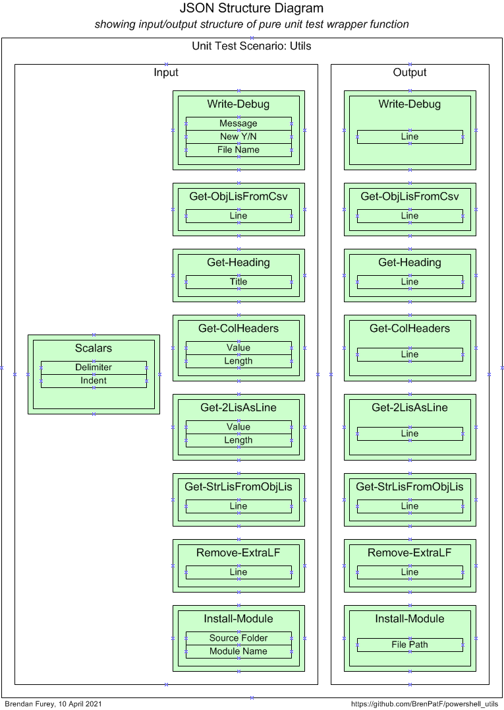
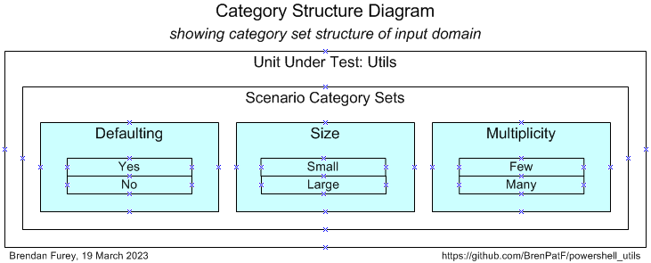

## Unit Testing

### Unit Testing Prerequisites

The powershell package TrapitUtils is required to run the unit tests. This is a subproject of the same GitHub project as Utils, so if you have downloaded it, you will already have it, and just need to install it. To do this open a powershell window in the install folder below TrapitUtils, and execute as follows:
```
$ ./Install-TrapitUtils
```
This will create a folder TrapitUtils under the first folder in your `psmodulepath` environment variable, and copy TrapitUtils.psm1 to it.

The powershell package includes an npm package to format the unit test output JSON file in HTML and/or text, but you need to have [Node.js](https://nodejs.org/en/download) installed to run it.

### Unit Testing Process

The package is tested using the Math Function Unit Testing design pattern, described here:  [Trapit - JavaScript Unit Tester/Formatter](https://github.com/BrenPatF/trapit_nodejs_tester). In this approach, a 'pure' wrapper function is constructed that takes input parameters and returns a value, and is tested within a loop over scenario records read from a JSON file.

In this case, where we have a set of small independent methods, most of which are pure functions, the wrapper function is designed to test all of them in a single generalised transaction.

At a high level the Math Function Unit Testing design pattern involves three main steps:

1. Create an input file containing all test scenarios with input data and expected output data for each scenario
2. Create a results object based on the input file, but with actual outputs merged in, based on calls to the unit under test
3. Use the results object to generate unit test results files formatted in HTML and/or text


The first and third of these steps are supported by generic utilities that can be used in unit testing in any language. The second step uses a language-specific unit test driver utility.

#### Step 1: Create JSON File

##### Unit Test Wrapper Function

The diagram below shows the structure of the input and output of the wrapper function.



From the input and output groups depicted we can construct CSV files with flattened group/field structures, and default values added, as follows (with `ps_utils_inp.csv` left, `ps_utils_out.csv` right):


##### Scenario Category ANalysis (SCAN)

The art of unit testing lies in choosing a set of scenarios that will produce a high degree of confidence in the functioning of the unit under test across the often very large range of possible inputs. A useful approach to this can be to think in terms of categories of inputs, where we reduce large ranges to representative categories, an approach discussed in [Unit Testing, Scenarios and Categories: The SCAN Method](https://brenpatf.github.io/jekyll/update/2021/10/17/unit-testing-scenarios-and-categories-the-scan-method.html). While the examples in the blog post aimed at minimal sets of scenarios, we have since found it simpler and clearer to use a separate scenario for each category.

After analysis of the possible scenarios in terms of categories and category sets, we can depict them on a Category Structure diagram:



We can tabulate the results of the category analysis, and assign a scenario against each category set/category with a unique description:

|  # | Category Set | Category      | Scenario      |
|---:|:-------------|:--------------|:--------------|
|  1 | Defaulting   | Yes           | Defaulted     |
|  2 | Defaulting   | No            | Not Defaulted |
|  3 | Size         | Small         | Small         |
|  4 | Size         | Large         | Large         |
|  5 | Multiplicity | Few           | Few           |
|  6 | Multiplicity | Many          | Many          |

From the scenarios identified we can construct the following CSV file (`ps_utils_sce.csv`), taking the category set and scenario columns, and adding an initial value for the active flag:


The API can be run with the following powershell in the folder of the CSV files:

!###### Format-JSON-Utils.ps1
```powershell
Import-Module TrapitUtils
Write-UT_Template 'ps_utils' '|'
```
This creates the template JSON file, ps_utils_temp.json, which contains an element for each of the scenarios, with the appropriate category set and active flag, with a single record in each group with default values from the groups CSV files.

#### Step 2: Create Results Object

Step 2 requires the writing of a wrapper function that is passed into a call to the unit test driver API.

- `Test-Unit` is the unit test driver function from the TrapitUtils package that reads the input JSON file, calls the wrapper function for each scenario, and writes the output JSON file with the actual results merged in along with the expected results

!##### Test-Utils.ps1 (skeleton)
```powershell
Import-Module Utils, TrapitUtils
function purelyWrap-Unit($inpGroups) { # input scenario groups
    function getWriteDebug($inpRecLis)                   { (function body) }
    function getObjLisFromCsv($inpRecLis, $delimiter)    { (function body) }
    function getHeading($inpRecLis, $indent)             { (function body) }
    function getColHeaders($inpRecLis, $indent)          { (function body) }
    function get2LisAsLine($inpRecLis, $indent)          { (function body) }
    function getStrLisFromObjLis($inpRecLis, $delimiter) { (function body) }
    function removeExtraLF($inpRecLis)                   { (function body) }
    function installModule($inpRecLis)                   { (function body) }
    $delimiter, $indent =  $inpGroups.'Scalars'.Split(';')
    #      Object key (group name)  Private function     Group value = list of input records  Function parameters
    [PSCustomObject]@{
          'Write-Debug'           = getWriteDebug        $inpGroups.'Write-Debug'
          'Get-ObjLisFromCsv'     = getObjLisFromCsv     $inpGroups.'Get-ObjLisFromCsv'       $delimiter
          'Get-Heading'           = getHeading           $inpGroups.'Get-Heading'             $indent
          'Get-ColHeaders'        = getColHeaders        $inpGroups.'Get-ColHeaders'          $indent
          'Get-2LisAsLine'        = get2LisAsLine        $inpGroups.'Get-2LisAsLine'          $indent
          'Get-StrLisFromObjLis'  = getStrLisFromObjLis  $inpGroups.'Get-StrLisFromObjLis'    $delimiter
          'Remove-ExtraLF'        = removeExtraLF        $inpGroups.'Remove-ExtraLF'    
          'Install-Module'        = installModule        $inpGroups.'Install-Module'
    }
}
Test-Unit ($PSScriptRoot + '/ps_utils.json') ($PSScriptRoot + '/ps_utils_out.json') `
          ${function:purelyWrap-Unit}
```
This creates the output JSON file: ps_utils_out.json. Generally it will be preferable not to call the script directly, but to include the call in a higher level script that calls it and also calls the JavaScript formatter, as in the next section.

#### Step 3: Format Results

Step 3 involves formatting the results contained in the JSON output file from step 2, via the JavaScript formatter, and this step can be combined with step 2 for convenience.

- `Test-Format` is the function from the TrapitUtils package that calls the main test driver function, then passes the output JSON file name to the JavaScript formatter and outputs a summary of the results. It takes the name of the test driver script and the JavaScript root location as parameters.

!#### Run-Test-Utils.ps1

```powershell
Import-Module TrapitUtils
Test-Format ($PSScriptRoot + '/Test-Utils.ps1') ($PSScriptRoot + '/../..')
```
This script creates a results subfolder, with results in text and HTML formats, in the script folder, and outputs the following summary:

```
Results summary for file: [MY_PATH]/powershell_utils/Utils/unit_test/ps_utils_out.json
============================================================================================================

File:          ps_utils_out.json
Title:         Powershell Utils
Inp Groups:    7
Out Groups:    7
Tests:         6
Fails:         0
Folder:        powershell-utils
```

Next we show the scenario-level summary of results.

You can review the HTML formatted unit test results here:

- [Unit Test Report: Get UT Template Object](http://htmlpreview.github.io/?https://github.com/BrenPatF/powershell_utils/blob/master/TrapitUtils/unit_test/get-ut-template-object/get-ut-template-object.html)

##### Unit Test Report - Powershell Utils

```
Unit Test Report: Powershell Utils
==================================

      #    Category Set  Scenario       Fails (of 9)  Status 
      ---  ------------  -------------  ------------  -------
      1    Defaulting    Defaulted      0             SUCCESS
      2    Defaulting    Not Defaulted  0             SUCCESS
      3    Size          Small          0             SUCCESS
      4    Size          Large          0             SUCCESS
      5    Multiplicity  Few            0             SUCCESS
      6    Multiplicity  Many           0             SUCCESS

Test scenarios: 0 failed of 6: SUCCESS
======================================
Tested: 2023-04-09 14:44:19, Formatted: 2023-04-09 14:44:19
```
